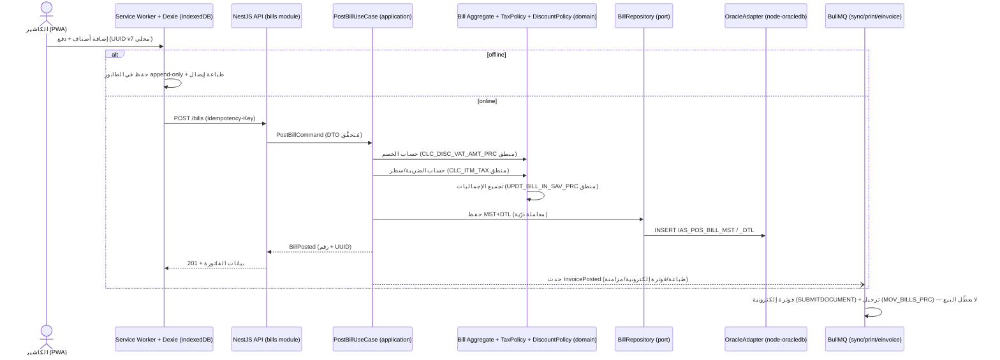
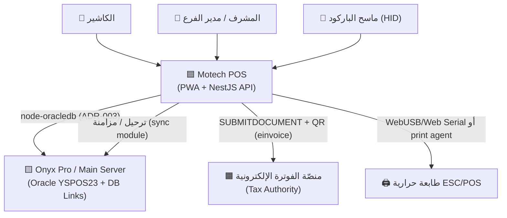
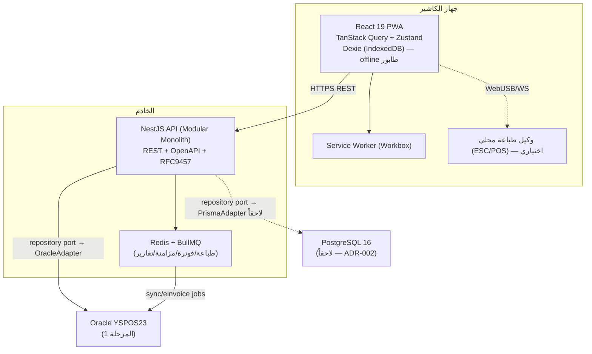

# 🏛️ معمارية Motech POS

> النمط: **Modular Monolith + Clean Architecture (Ports & Adapters) + Tactical DDD**.
> القرارات الأساسية: راجع `docs/adr/ADR-001..005`. الحقائق: `docs/db/*` و`db/schema/*` (proof-based).
> آخر تحديث: 2026-06-29 (المرحلة 1 — التصميم).

---

## 1) نظرة عامة

Motech POS نظام نقاط بيع web حديث (عربي/RTL، offline-first PWA) بديل عن YemenSoft Onyx Pro، يعمل في **المرحلة الأولى على نفس بيانات Oracle `YSPOS23`** عبر طبقة repository مجرّدة (ADR-003)، مع خطة انتقال لاحقة لـ PostgreSQL (ADR-002). الترحيل من Onyx بنمط Strangler-Fig (ADR-005).

**المبادئ الحاكمة:**
- التبعيات تتجه للداخل: `presentation → application → domain`؛ `infrastructure` يُحقن عبر DI.
- كل module = Bounded Context واحد، حدوده صريحة (لا وصول مباشر لبيانات module آخر — فقط ports/events).
- منطق الأعمال المالي ذرّي ومُختبَر، مستقل عن المحرّك.
- المال = `NUMERIC` (لا float)؛ الفواتير immutable؛ Idempotency على العمليات المالية.

---

## 2) الطبقات (Clean / Hexagonal)

```
┌──────────────────────────────────────────────────────────┐
│  presentation   Controllers (REST), HTTP DTOs, mappers    │  ← NestJS
│  ──────────────────────────────────────────────────────   │
│  application    Use-Cases / Command+Query handlers, DTOs   │  ← التنسيق
│  ──────────────────────────────────────────────────────   │
│  domain         Entities, Value Objects, Aggregates,       │  ← القلب (نقي)
│                 Domain Services, Domain Events, Ports       │
│  ──────────────────────────────────────────────────────   │
│  infrastructure Oracle/Postgres repos, BullMQ, طابعة,      │  ← Adapters
│                 بوابة فوترة إلكترونية, sync adapters         │     (تُحقن)
└──────────────────────────────────────────────────────────┘
       قاعدة التبعية: الخارج يعرف الداخل، الداخل لا يعرف الخارج.
```

- **domain:** لا يعرف HTTP/DB/Oracle. يعرّف **Ports** (interfaces) مثل `BillRepository`, `ItemRepository`, `TaxPolicy`, `PrinterPort`, `EInvoiceGateway`.
- **application:** use-cases (مثل `PostBillUseCase`, `OpenShiftUseCase`) تعتمد على الـ ports فقط.
- **infrastructure:** adapters ملموسة (`OracleBillRepository` عبر `node-oracledb` الآن، `PrismaBillRepository` لاحقاً).
- **presentation:** controllers نحيفة (validation + استدعاء use-case + تشكيل الاستجابة).

---

## 3) الـ Modules (Bounded Contexts)

كل module يطابق domain حقيقياً مُكتشفاً من schema YSPOS23 والشاشات.

| Module | المسؤولية | الجداول الحقيقية الأساسية | الحِزَم الأصلية المرجعية | شاشات Onyx |
|--------|-----------|----------------------------|---------------------------|-------------|
| **auth** | الدخول، الجلسة، RBAC، تتبّع الدخول | `USER_R`, `IAS_USR_LGN_HSTRY`, `S_BRN_USR_PRIV`, `IAS_POS_PRIV_MACHINE` | `IAS_USR_PKG`, `SECURITY_PKG` | POSLGN, POSS002, POSS004 |
| **shifts** | فتح/إقفال ورديات الكاشير، العهدة، الفروقات | `POS_WRK_SHFT`, `POS_WRK_SHFT_CSHR`, `POS_FNCL_ADVNC_CSHR`, `IAS_DEPOSIT_CURRENCY_MST` | `PKG_POS_WRK_SHFT_PKG` | POST027, POST014, POST015 |
| **catalog/items** | الأصناف، الأسعار، الكميات المتاحة، الباركود | `IAS_ITM_MST`*, `IAS_ITEM_PRICE`*, `MV_ITEM_AVL_QTY`, `IAS_POS_AUD_ITEM` | `IAS_ITM_PKG`, `PKG_POS_SNPSHT_PKG` | POSI2000, POST016 |
| **bills (sales)** | فاتورة البيع: استقبال/حساب/إدراج/تجميع، المعلّقة | `IAS_POS_BILL_MST`, `IAS_POS_BILL_DTL`, `IAS_POS_HUNG_BILLS`, `IAS_POS_RT_BILL_MST/DTL` | `PKG_POS_API_PKG`, `PKG_POS_GNR_PKG` | POST001, POST002, POST003 |
| **payments** | الدفع (نقد/بطاقة/عملات)، السندات | `IAS_POS_PAY_BILLS`, `IAS_POS_PAY_CASH`, `POS_BILL_CRDT_CRD`, `POS_GNR_RCPTS/EXPNS` | جزء الدفع من `PKG_POS_API_PKG`, `PKG_POS_RCPTS_EXPNS_API_PKG` | POST010, POST011, POST025, POST026 |
| **tax** | حساب VAT، حركة الضريبة، الفئات الضريبية | `POS_TAX_ITM_MOVMNT`, `POS_TAX_INPT_MOVMNT` (مرجع: `GNR_TAX_*`) | `PKG_YS_TAX_PKG` | (عرضي في POST001) |
| **loyalty** | نقاط الولاء واكتسابها/استبدالها/صلاحيتها | `Pos_Point_Calc_trns`*, `IAS_POS_CUSTOMER_CARD_AMOUNT` | `PKG_POS_POINT_PKG` | POST020, POST021 |
| **customers** | العملاء النقديون والمسجّلون | `IAS_CASH_CUSTMR`, `CUSTOMER`* | جزء العميل من `PKG_POS_API_PKG` | POSI010, POST020 |
| **reports** | تقارير يومية/مناوبة/كاشير/ضريبة (CQRS قراءة) | views + `IAS_POS_BILL_MST/DTL`, `POS_WRK_SHFT_CSHR` | `GET_POS_DATA`, `GET_BILL_DATA_XML` | POSR001..016, POST012, POST013 |
| **einvoice** | الفاتورة الإلكترونية + QR/TLV (adapter قابل للتهيئة) | `GNR_QR_CODE`, `ARS_INTRMDT_CMPNY` | `PKG_GNR_TECH_SOLUTION_PKG`, `PKG_GNR_QR_CODE_API_PKG`, `PKG_GNR_E_INVC_OP` | (تابع POST001) |
| **sync** | الترحيل (POS→Main) + المزامنة الخارجية + الطابور | `POS_SYNC_MNGMNT`, `POS_SQL_QUEUE`, `IAS_POS_SERVER_DB_LINK`, `POS_EXTRNL_DOC_SYNC` | `PKG_POS_MOV_TRNS_PKG`, `PKG_POS_SYNC_JOB_AUTO_PKG`, `PKG_POS_UPLINES_PKG` | POST008 |
| **settings** | إعدادات POS، الأجهزة، لوحة المفاتيح، الصلاحيات | `IAS_PARA_POS`, `IAS_POS_MACHINE`, `POS_DFLT_STNG_MST/DTL`, `IAS_POS_KEY_BRD_GRPS_*` | `POS_GNR_PKG`, إعدادات | POSS001, POSS005, POSI001, POST009 |

`*` = جدول مرجعي يقيم في الـ schema المركزي (`IAS202623`)؛ يُقرأ كمرجع، لا تملكه طبقة POS.

**القاعدة:** `shared` (kernel: `Money`, `Result`, base entities, guards) لا يعتمد على أي module. لا module يستورد داخليات module آخر.

---

## 4) تدفّق البيانات — دورة البيع (مطابقة لـ SALES_FLOW.md)



**ثوابت حرجة (من الكود الأصلي، مفروضة في domain):**
1. لا بيع بلا **وردية مفتوحة** (`GET_WRK_SHFT_OPN_FNC` → `POS_WRK_SHFT_CSHR.CLS_DATE IS NULL`).
2. كل الإجماليات **يُعاد حسابها** من الأسطر بعد الإدراج (لا يُوثَق برأس الفاتورة الوارد).
3. الضريبة نوعان: على السعر الكامل أو بعد الخصم (`CLC_TYP_NO_TAX` على الجهاز).
4. الخصم نوعان: تفصيلي (`DIS_AMT_DTL`) ورأس (`DISC_AMT_MST`) يُوزَّع تناسبياً.
5. **لا ترحيل قبل المزامنة الضريبية** (حارس `-20001`).
6. الفاتورة **immutable** بعد الإصدار؛ التصحيح بمرتجع.

---

## 5) مخطّط C4

### المستوى 1 — السياق (Context)



### المستوى 2 — الحاويات (Container)



---

## 6) كيف يتصل بـ Oracle (ADR-003)

- مكتبة `node-oracledb` (تتطلب Oracle Instant Client) مع **connection pool** مُدار في NestJS module مخصّص (`OracleModule`).
- كل وصول للبيانات خلف **port** في الـ domain؛ التطبيق (`OracleXxxRepository`) في infrastructure يستخدم **bind variables مُعلْمَنة دائماً** (لا string concatenation — أمان SQLi).
- أسماء الجداول/الأعمدة الحقيقية فقط (مثل `IAS_POS_BILL_MST.BILL_NO`, `IAS_POS_BILL_DTL.I_CODE`). لا أسماء مخترعة.
- يحترم البنية الموزّعة: قراءة الكميات من `MV_ITEM_AVL_QTY`؛ احترام `POSTED/HUNG/WEB_SRVC_TRNSFR_DATA_FLG`.
- التحويل لاحقاً لـ Postgres = adapter جديد (`PrismaXxxRepository`) + migration، بلا لمس domain/application.

---

## 7) إستراتيجية الأمان (موجز — التفصيل في STANDARDS/07)

- **المصادقة:** JWT قصير العمر + refresh في Redis (stateless للتوسّع). كلمات السر مُجزّأة (Argon2/bcrypt) — لا تكرار لـ `DECRYPT_PASS` الضعيف.
- **التفويض (RBAC):** أدوار (كاشير/مشرف/مدير فرع) + صلاحيات حقول، مستندة لـ `S_BRN_USR_PRIV`/`PRIVILEGE_GC`. عمليات حسّاسة (إلغاء/مرتجع/خصم كبير) تتطلب موافقة مشرف (PIN/MFA).
- **عزل الفروع (multi-branch):** كل سجل قابل للمزامنة يحمل `BRN_NO/CMP_NO`؛ منع IDOR.
- **التدقيق:** سجل غير قابل للتعديل (من باع/ألغى/استرجع/فتح الدرج) — يماثل `IAS_USR_LGN_HSTRY` ويُوسَّع.
- **المدخلات:** `ValidationPipe` (whitelist) + bind variables؛ لا تسريب stack/DB في أخطاء RFC 9457.
- **المال:** `NUMERIC`، معاملات ذرّية، Idempotency-Key، لا تخزين بيانات بطاقات خام (tokenization).
- **النقل:** HTTPS فقط؛ أسرار في `.env`/vault لا في git.

---

## 8) القرارات المرتبطة
ADR-001 (النمط) · ADR-002 (الحزمة) · ADR-003 (Oracle أولاً) · ADR-004 (offline/PWA) · ADR-005 (Strangler-Fig).
نموذج البيانات: `DATA_MODEL.md` · الـ API: `API_DESIGN.md` · ترتيب الشاشات: `SCREENS_PRIORITY.md` · الهيكلة: `PROJECT_STRUCTURE.md`.
