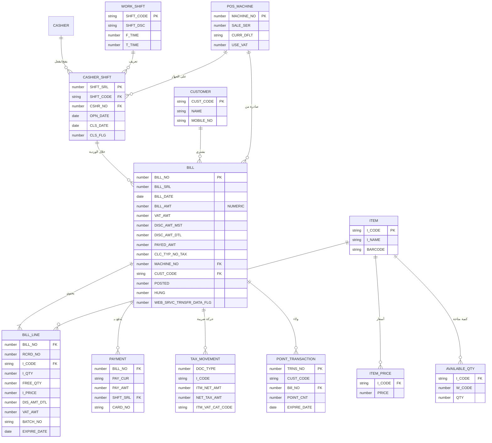

# 🗃️ نموذج بيانات Motech POS

> تعيين (mapping) جداول YSPOS23 الحقيقية → entities النظام الجديد. كل الأعمدة مُستخرَجة من `db/schema/tables/*.sql` (DDL حقيقي) — صفر اختراع.
> المنهج: ADR-003 (Oracle أولاً خلف ports، المنطق يُعاد كتابته). آخر تحديث: 2026-06-29.

---

## 1) مبادئ النمذجة (من STANDARDS/04)

- **Aggregate جذره `Bill`** يحرس ثبات الفاتورة + أسطرها (`BillLine`).
- **Value Objects:** `Money(amount, currency)` بـ `NUMERIC` (لا float)، `Sku`, `Quantity`, `TaxRate`, `BillNumber`.
- في النظام الجديد (Postgres لاحقاً): PK = **UUID v7** (لتوليد offline)، مع الاحتفاظ بالأرقام الأصلية (`BILL_NO`) كمعرّف خارجي/قانوني. في المرحلة 1 نتعامل مع المفاتيح الأصلية كما هي.
- التواريخ ISO-8601/`timestamptz`، الفواتير **soft-delete only** (لا حذف قانوني).

---

## 2) التعيين الأساسي (YSPOS23 → Entities)

### 2.1 `Bill` ← `IAS_POS_BILL_MST` (20,569 صف · PK=`BILL_NO`)

| عمود Oracle (حقيقي) | حقل Entity | النوع / ملاحظة |
|----------------------|-----------|-----------------|
| `BILL_NO` (NUMBER 38) | `billNo` | المعرّف القانوني (PK أصلي) |
| `BILL_SRL` | `billSerial` | تسلسل داخلي |
| `BILL_DATE` + `BILL_TIME` | `issuedAt` | يُدمج لـ timestamptz |
| `BILL_TYPE` / `SI_TYPE` | `billType` / `salesType` | نوع الفاتورة |
| `C_CODE` / `C_NAME` / `CUST_CODE` / `MOBILE_NO` | `customerRef` | عميل (Value/ref لـ customers module) |
| `A_CY` / `BILL_RATE` | `currency` / `rate` | عملة + سعر صرف |
| `BILL_AMT` | `total` (Money) | `NUMERIC` |
| `VAT_AMT` | `vatTotal` | `NUMERIC` |
| `DISC_AMT` / `DISC_AMT_MST` / `DISC_AMT_DTL` | `discountTotal` / `discountHeader` / `discountLines` | `NUMERIC` |
| `PAYED_AMT` / `CARD_AMT` / `RET_AMT` | `paidAmount` / `cardAmount` / `returnAmount` | |
| `MACHINE_NO` / `CASH_NO` / `W_CODE` | `machineNo` / `cashAccount` / `warehouse` | |
| `CLC_TYP_NO_TAX` | `taxCalcType` | نوع حساب الضريبة (1=على السعر، 2=بعد الخصم) |
| `POSTED` | `postedFlag` | حالة الترحيل (sync) |
| `HUNG` / `HUNG_U_ID` / `HUNG_DATE` | `isHeld` / آثار التعليق | الفاتورة المعلّقة |
| `POINT_TYP_NO` / `POINT_CALC_TYP_NO` / `POINT_RPLC_AMT` | حقول الولاء | تربط loyalty module |
| `QT_PRM_NO` / `QT_PRM_SER` | `promotionRef` | العروض |
| `CR_CARD_*` (مجموعات 1/2/3) | `cardPayments[]` | بطاقات ائتمان متعددة |
| `WEB_SRVC_TRNSFR_DATA_FLG` / `FDA_CODE` | `eInvoiceStatus` | حالة الفوترة الإلكترونية |
| `AD_U_ID` / `AD_DATE` / `UP_U_ID` / `UP_DATE` | حقول التدقيق | created/updated by/at |
| `FIELD1..5` | `customFields` | حقول مرنة |

### 2.2 `BillLine` ← `IAS_POS_BILL_DTL` (41,945 صف · FK=`BILL_NO` · فهرس فريد `POSBILLDTL_UQ`، heap بلا PK)

| عمود Oracle | حقل Entity | ملاحظة |
|-------------|-----------|--------|
| `BILL_NO` / `BILL_SRL` | `billRef` | FK للرأس |
| `RCRD_NO` | `lineNo` | ترتيب السطر (ORDER في الشاشة) |
| `I_CODE` | `itemCode` (Sku) | الصنف |
| `I_QTY` / `FREE_QTY` | `quantity` / `freeQuantity` | (Quantity VO) |
| `I_PRICE` / `I_PRICE_VAT` | `unitPrice` / `unitPriceInclVat` | `NUMERIC` |
| `ITM_UNT` / `P_SIZE` / `P_QTY` | `unit` / `packSize` / `packQty` | |
| `DIS_PER` / `DIS_AMT` / `DIS_AMT_DTL` / `DIS_AMT_MST` | الخصم (تفصيلي + موزّع) | |
| `VAT_PER` / `VAT_AMT` | `vatRate` / `vatAmount` | + المتغيرات (`VAT_AMT_BFR_DIS`, `VAT_AMT_AFTR_DIS`...) |
| `BATCH_NO` / `EXPIRE_DATE` / `BARCODE` | `batch` / `expiry` / `barcode` | للأدوية/الباركود |
| `W_CODE` / `SERVICE_ITEM` | `warehouse` / `isService` | |
| `QT_PRM_NO` / `QT_PRM_SER` / `PRM_GRP_NO` | `promotionRef` | العروض المطبّقة |
| `ORDER_SER` / `ORDER_NO` | `salesOrderRef` | ربط بأمر بيع |
| `CMP_NO` / `BRN_NO` / `BRN_YEAR` / `BRN_USR` | مفاتيح المؤسسة/الفرع | multi-branch |

### 2.3 `Item` ← `IAS_ITM_MST` + `IAS_ITEM_PRICE` + `MV_ITEM_AVL_QTY` (مرجعي مركزي)
- `Item`: `itemCode (I_CODE)`, `name`, `unit`, `barcode`, `taxCategory`. (يقيم في schema مركزي — يُقرأ كمرجع).
- `ItemPrice` ← `IAS_ITEM_PRICE`: السعر حسب مستوى السعر/العملة.
- `AvailableQty` ← `MV_ITEM_AVL_QTY` (PK=`I_CODE,W_CODE,EXPIRE_DATE,BATCH_NO`, 2,004 صف): الكمية المتاحة (السلطة للخادم/المركز).

### 2.4 `User` / `Cashier` ← `USER_R` (+ `IAS_USR_LGN_HSTRY`, `S_BRN_USR_PRIV`)
- `User`: `userId (U_ID)`, `name`, `terminal (TRMNL_NAME)`, `loggedOn`, cash account ربط.
- `LoginHistory` ← `IAS_USR_LGN_HSTRY` (608 صف): تدقيق الدخول.
- صلاحيات: `S_BRN_USR_PRIV` / `PRIVILEGE_GC` → RBAC.

### 2.5 `WorkShift` / `CashierShift` ← `POS_WRK_SHFT` + `POS_WRK_SHFT_CSHR`
- `WorkShift` ← `POS_WRK_SHFT` (PK=`SHFT_CODE`): تعريف الوردية (`SHFT_DSC`, `F_DATE/T_DATE`, `F_TIME/T_TIME`, `INACTIVE`).
- `CashierShift` ← `POS_WRK_SHFT_CSHR` (PK=`SHFT_SRL`): فتح/إقفال (`CSHR_NO`, `OPN_DATE`, `CLS_DATE`, `CLS_FLG`, `CLS_U_ID`, `SHFT_CODE`). **شرط البيع:** `CLS_DATE IS NULL`.
- العهدة/الافتتاحي ← `POS_FNCL_ADVNC_CSHR`؛ الإيداع عند الإقفال ← `IAS_DEPOSIT_CURRENCY_MST`.

### 2.6 `Payment` ← `IAS_POS_PAY_BILLS` (+ `IAS_POS_PAY_CASH`, `POS_BILL_CRDT_CRD`)
| عمود | حقل | ملاحظة |
|------|-----|--------|
| `BILL_NO`/`BILL_SRL`/`RT_BILL_NO` | `billRef` | الفاتورة (دائمة/لحظية) |
| `PAY_CUR`/`PAY_AMT`/`PAY_RATE`/`BILL_PAY_AMT` | `currency`/`amount`/`rate`/`amountInBillCcy` | عملات متعددة |
| `CARD_NO`/`CARD_AMT_FREE`/`CARD_FREE_FLG` | `card` | بطاقة |
| `BILL_TYPE`/`C_CODE` | `type`/`customerRef` | |
| `SHFT_SRL` | `shiftRef` | ربط بالوردية |
| `DOC_POST`/`DOC_PST_SQ`/`DB_LINK_NM` | حالة الترحيل | sync |

### 2.7 الضريبة ← `POS_TAX_ITM_MOVMNT` (+ `_INPT_MOVMNT`)
- `TaxMovement`: `DOC_TYPE` (4=بيع، 5=مرتجع), `ITM_NET_PRICE`, `ITM_NET_QTY`, `ITM_NET_AMT`, `NET_TAX_AMT`, `ITM_VAT_CAT_CODE`, `TAX_CUR_CODE/RATE`, `BILL_TAX_STATUS`. يُبنى **بعد الحفظ** (`CLC_ITM_TAX_AFTR_SAVE`).
- مرجع النسب: `GNR_TAX_CODE_MST`/`GNR_TAX_TYP_CLC_MST` (مركزي) عبر `GET_ITM_TAX_PRCNT`.

### 2.8 الولاء ← `Pos_Point_Calc_trns` (+ `IAS_POS_CUSTOMER_CARD_AMOUNT`)
- `PointTransaction`: `TRNS_NO`, `TRNS_DATE`, `CUST_CODE`, `MOBILE_NO`, `POINT_TYP_NO`, `Bill_NO`, `DOC_AMT`, `POINT_CNT`, `TRNS_TYPE`, `Point_Amt`, `EXPIRE_DATE`. التسلسل `POS_POINT_SEQ` محلي؛ أنواع النقاط مركزية.

### 2.9 الفاتورة اللحظية (RT) ← `IAS_POS_RT_BILL_MST/DTL`
نفس بنية `Bill`/`BillLine` لكن لمسار online فوري (PK=`RT_BILL_NO`)، يُزامَن خارجياً مباشرة (`POS_EXTRNL_DOC_SYNC`).

### 2.10 الجهاز/الإعدادات ← `IAS_POS_MACHINE`, `IAS_PARA_POS`, `POS_DFLT_STNG_MST/DTL`
- `PosMachine` ← `IAS_POS_MACHINE` (3 صفوف، PK=`MACHINE_NO`): `SALE_SER` (عدّاد الترقيم), `TERMINAL`, `CURR_DFLT`, `USE_VAT`, `CLC_TYP_NO_TAX` (عبر المنطق), `DEF_WCODE`, `RETURN_PERIOD`, `CHANGE_PERIOD`, `DRAWER_PORT`. **حرج للترقيم والضريبة**.

---

## 3) ما نُبقيه في Oracle أولاً مقابل ما نهاجره

| الفئة | المرحلة 1 (Oracle) | لاحقاً (Postgres) | السبب |
|------|---------------------|--------------------|-------|
| الفواتير (MST/DTL/RT) | قراءة/كتابة | تُهاجر (immutable) | البيانات الحيّة + البيع الفوري |
| الورديات/الدفع | كتابة Oracle | تُهاجر | جزء من دورة البيع |
| الأصناف/الأسعار/الكميات | قراءة مرجعية (مركزي/MV) | تبقى مرجعاً مركزياً يُسحب للـ PWA | السلطة للمركز (multi-branch) |
| الضريبة (حركة + نِسَب) | adapter PL/SQL مؤقتاً + إعادة كتابة الحساب | adapter قابل للتهيئة لكل دولة | امتثال حسّاس |
| الفوترة الإلكترونية | adapter لـ `GNR_TECH_SOLUTION_PKG` | يُعاد بناؤه | تكامل ناضج، مخاطرة عالية |
| المزامنة/الترحيل | adapter لـ `POS_MOV_TRNS_PKG` | يُعاد بناؤه في sync module | منطق موزّع معقّد |
| الإعدادات/الأجهزة/الصلاحيات | قراءة/كتابة Oracle | تُهاجر | مرتبطة بالتشغيل |

---

## 4) ERD النظام الجديد (Mermaid)

> ملاحظة: العلاقات أعلاه منطقية (مفروضة في domain). في Oracle الفعلي عدد FKs قليل (9 فقط) والمنطق المالي مفروض في PL/SQL لا في قيود DB — لذا نفرضها صراحةً في طبقة domain (Aggregate invariants) وفي مخطط Postgres لاحقاً (FKs + CHECK + NOT NULL).
