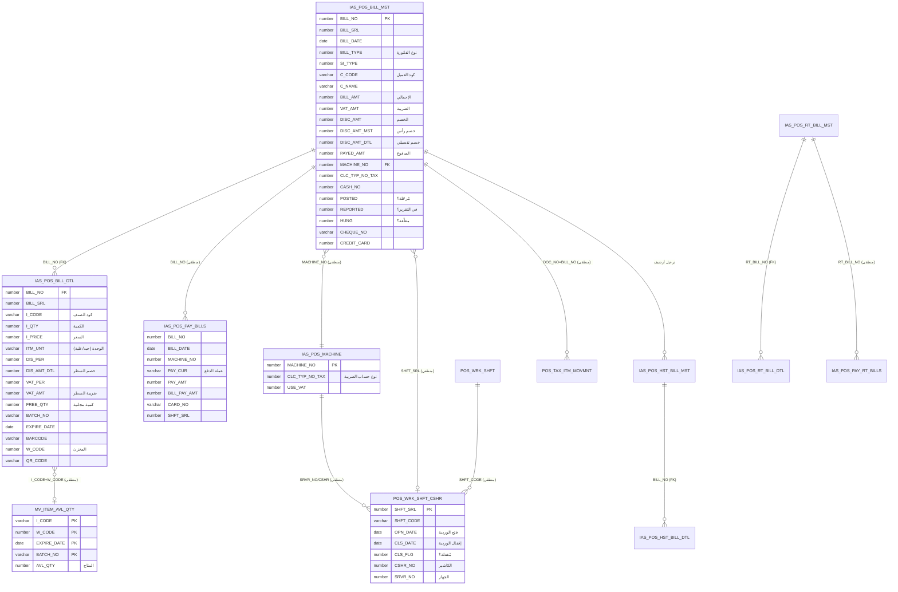

# YSPOS23 — مخطط العلاقات (ERD)

> **المنهج:** proof-not-assumption. الـ FK الـ9 أدناه مُستخرجة حيّاً من `ALL_CONSTRAINTS` (constraint_type='R').
> **ملاحظة معمارية مهمة:** نظام YemenSoft POS **لا يعتمد على FK declarative كثيرة** — التكامل يُفرض في طبقة PL/SQL (packages + 1 trigger). معظم "العلاقات المنطقية" بين الجداول تُربط بأعمدة مشتركة (مثل `BILL_NO`, `I_CODE`, `MACHINE_NO`, `SHFT_SRL`, `C_CODE`) دون قيد FK رسمي. لذلك ندمج: (أ) الـFK الفعلية، (ب) العلاقات المنطقية المُستنتجة من الأعمدة والكود.

---

## 1) الـ Foreign Keys الفعلية (9 — حيّة)

| Constraint | الجدول الابن | العمود | → الجدول الأب | العمود |
|-----------|-------------|--------|--------------|--------|
| `FK_POSBILLDETAIL_BILLNO` | IAS_POS_BILL_DTL | BILL_NO | → IAS_POS_BILL_MST | BILL_NO |
| `FK_POSRTBILLDETAIL_BILLNO` | IAS_POS_RT_BILL_DTL | RT_BILL_NO | → IAS_POS_RT_BILL_MST | RT_BILL_NO |
| `FK_POSHSTBILLDETAIL_BILLNO` | IAS_POS_HST_BILL_DTL | BILL_NO | → IAS_POS_HST_BILL_MST | BILL_NO |
| `FK_POSHSTRTBILLDETAIL_BILLNO` | IAS_POS_HST_RT_BILL_DTL | RT_BILL_NO | → IAS_POS_HST_RT_BILL_MST | RT_BILL_NO |
| `FK_POSPAYHSTRTBILL_BILLNO` | IAS_POS_PAY_HST_RT_BILLS | RT_BILL_NO | → IAS_POS_HST_RT_BILL_MST | RT_BILL_NO |
| `IAS_POS_JRNL_DIFF_CSHR_FK` | IAS_POS_JRNL_DIFF_CSHR_DTL | DOC_SER | → IAS_POS_JRNL_DIFF_CSHR_MST | DOC_SER |
| `IAS_FK_KGPS_DTL` | IAS_POS_KEY_BRD_GRPS_DTL | (EXTRA_KEYPAD_NO, KGRP_CODE) | → IAS_POS_KEY_BRD_GRPS_MST | (EXTRA_KEYPAD_NO, KGRP_CODE) |
| `IAS_FK_KGRPS_MST` | IAS_POS_KEY_BRD_GRPS_MST | EXTRA_KEYPAD_NO | → IAS_POS_EXTRA_KEYPAD | EXTRA_KEYPAD_NO |
| `POS_DFLT_STNG_DTL_FK` | POS_DFLT_STNG_DTL | STNG_NO | → POS_DFLT_STNG_MST | STNG_NO |

**العلاقة المحورية:** `IAS_POS_BILL_MST (1) ──< IAS_POS_BILL_DTL (N)` عبر `BILL_NO`.

## 2) Primary Keys للجداول الأساسية (حيّة)

| الجدول | PK |
|--------|-----|
| IAS_POS_BILL_MST | `BILL_NO` |
| IAS_POS_BILL_DTL | **لا يوجد PK** — فهرس فريد `POSBILLDTL_UQ` (يعتمد BILL_NO+ترتيب السطر) |
| IAS_POS_RT_BILL_MST | `RT_BILL_NO` |
| IAS_POS_MACHINE | `MACHINE_NO` |
| POS_WRK_SHFT | `SHFT_CODE` |
| POS_WRK_SHFT_CSHR | `SHFT_SRL` |
| POS_SYNC_MNGMNT | `TBL_NM` |
| MV_ITEM_AVL_QTY | `(I_CODE, W_CODE, EXPIRE_DATE, BATCH_NO)` |

---

## 3) ERD — قلب نظام المبيعات (Mermaid)



> **مفتاح القراءة:**
> - `(FK)` = قيد علاقة فعلي في القاعدة.
> - `(منطقي)` = علاقة مُستنتجة من الأعمدة المشتركة ومنطق الـ PL/SQL (لا يوجد قيد رسمي، لكنها العلاقة الحقيقية في الكود).

---

## 4) العلاقات المنطقية المهمة (مُستنتجة من الكود/الأعمدة)

| من | إلى | عبر | المصدر |
|----|-----|-----|--------|
| IAS_POS_BILL_MST | IAS_POS_PAY_BILLS | `BILL_NO` | `POS_API_PKG.EXTRCT_POS_BILL_PRC` يُدخل الدفعات |
| IAS_POS_BILL_MST | IAS_POS_MACHINE | `MACHINE_NO` | trigger `IAS_POS_BILL_CHK_TYP_TAX_TRG` يقرأ `CLC_TYP_NO_TAX` من الجهاز |
| IAS_POS_BILL_DTL | الصنف المركزي `IAS_ITM_MST` | `I_CODE` | (الصنف في الـschema المركزي؛ محلياً عبر `MV_ITEM_AVL_QTY`) |
| IAS_POS_BILL_DTL | MV_ITEM_AVL_QTY | `I_CODE + W_CODE` | functions `GET_ICODE_AVLQTY` تتحقق من الكمية |
| IAS_POS_BILL_MST | POS_TAX_ITM_MOVMNT | `DOC_NO=BILL_NO, DOC_SER=BILL_SRL` | `YS_TAX_PKG.CLC_ITM_TAX_AFTR_SAVE` (DOC_TYP=4) |
| IAS_POS_BILL_MST | POS_WRK_SHFT_CSHR | `SHFT_SRL` | يُسجَّل في الدفع `IAS_POS_PAY_BILLS.SHFT_SRL` |
| الفاتورة | العميل المركزي `CUSTOMER`/`IAS_CASH_CUSTMR` | `C_CODE`/`CUST_CODE` | `POS_POINT_PKG`، `YS_TAX_PKG.GET_TAX_BILL_TYP` |

## 5) دورة حياة الفاتورة عبر الجداول

```
RT (لحظي)          الرئيسي (محلي)         الأرشيف (history)        المركزي (sync)
IAS_POS_RT_BILL_*  →  IAS_POS_BILL_*   →  IAS_POS_HST_BILL_*   →  [DB_LINK → خادم مركزي]
                      + IAS_POS_PAY_BILLS    (عبر POS_MOV_TRNS_PKG.MOV_BILLS_TO_HSTRY_PRC)
                      + POS_TAX_ITM_MOVMNT
```
