# YSPOS23 — دورة البيع الكاملة (Sales Flow)

> **المنهج:** proof-not-assumption — كل خطوة مربوطة باسم **procedure/جدول/عمود حقيقي** مُستخرَج من ملفات `db/schema/plsql/` و`db/schema/tables/`.
> **السياق:** نظام YemenSoft POS موزّع: كاشير (offline-capable) → قاعدة POS فرعية → السيرفر الرئيسي (Main) → منصّة الفوترة الإلكترونية.
> **التاريخ:** 2026-06-29 (المرحلة 0-ب).

---

## 1) نظرة عامة على المسار

```
فتح وردية → إدخال أصناف → استخراج XML الفاتورة → حساب الخصم والضريبة
→ إدراج MST/DTL → إعادة التجميع → حركة الضريبة → الدفع → الولاء
→ (RT bill اختياري) → الفوترة الإلكترونية → الترحيل/الإقفال → التقارير
```

النظام يميّز بين مسارين:
- **الفاتورة الدائمة** `IAS_POS_BILL_MST/DTL` (مبيعات نهائية مُرحَّلة).
- **الفاتورة اللحظية (RT)** `IAS_POS_RT_BILL_MST/DTL` (لحظية online قبل الترحيل، تُزامَن فوراً مع منصّات خارجية).

---

## 2) الخطوات التفصيلية مربوطة بالكود

### الخطوة 0 — فتح الوردية (Work Shift)
- **Proc:** `PKG_POS_WRK_SHFT_PKG.INSRT_WRK_SHFTS(P_XML_INPT)` → يدرج صفاً في **`POS_WRK_SHFT_CSHR`** (`SHFT_SRL` PK, `CSHR_NO, SHFT_CODE, F_DATE/T_DATE, F_TIME/T_TIME, CLS_FLG=0, CLS_DATE=NULL`).
- **شرط البيع:** `GET_WRK_SHFT_OPN_FNC(P_CSHR_NO)` يجب أن يُرجع `SHFT_SRL` مفتوح (`CLS_DATE IS NULL`, ضمن نطاق الوقت).
- الرصيد الافتتاحي/العهدة: **`POS_FNCL_ADVNC_CSHR`** عبر `GET_PNG_BLNC`.

### الخطوة 1 — استقبال الفاتورة (XML → DB)
- **Proc:** `PKG_POS_API_PKG.EXTRCT_POS_BILL_PRC(P_XML CLOB, P_JSON_RSLT OUT CLOB)`.
- يفكّ XML بـ `XMLTYPE.CREATEXML` + `EXTRACTVALUE('/IAS_POS_BILL/IAS_POS_BILL_MST')` للرأس و`/.../IAS_POS_BILL_DTL` للأسطر.
- `SAVE_TYP`: `0=offline` (BILL_NO مُولَّد محلياً، إلزامي)، `1=online حفظ`، `2=حساب فقط بلا حفظ`، `3=حساب ثم حفظ ثم إرجاع`.

### الخطوة 2 — توليد رقم الفاتورة (online فقط)
- **Proc:** `PKG_POS_GNR_PKG.GET_BILL_NO_PRC` → يقرأ `IAS_PARA_POS` و`IAS_POS_MACHINE.SALE_SER`، يبني `BILL_NO` و`BILL_SRL` و`DOC_MCHN_SQ`، ويحدّث `IAS_POS_MACHINE.SALE_SER`.
- التاريخ: `GET_DATE_INCRS_DCRS_PRC`.
- **فاتورة معلّقة (HUNG=1):** حذف مسبق من `IAS_POS_BILL_MST/DTL`, `POS_TAX_ITM_MOVMNT (DOC_TYPE=4)`, `IAS_POS_PAY_BILLS` ثم إعادة بناء.

### الخطوة 3 — التحقق من الأصناف والأسعار
- `Chk_Itm` (DOC_TYPE 4=فاتورة بيع، 5=مرتجع بيع)، `CHK_ITM_PRICE`, `Chk_Price_Lmt`.
- الكمية المتاحة: `FUNC_GET_ICODE_AVLQTY` / `MV_ITEM_AVL_QTY`.

### الخطوة 4 — حساب الخصم
- **Proc:** `CLC_DISC_VAT_AMT_PRC` يوزّع `DISC_AMT_MST` (خصم الرأس) على الأسطر تناسبياً مع `DIS_AMT_DTL` (خصم تفصيلي): `DIS_AMT = DIS_AMT_MST + DIS_AMT_DTL`. يدعم بطاقة الخصم (`CRD_DISC_PER`) والعروض.

### الخطوة 5 — حساب الضريبة (VAT) لكل سطر
- **Proc:** `CLC_ITM_TAX` يأخذ النسبة من `YS_TAX_PKG.GET_ITM_TAX_PRCNT(CLC_TYP_NO_TAX, I_CODE)`.
  - نوع 1: `VAT_AMT = ROUND(I_PRICE*VAT_PRCNT/100,12)`.
  - نوع 2 (بعد الخصم): `VAT_AMT = ROUND((I_PRICE-(DIS_AMT_DTL+DIS_AMT_MST))*VAT_PRCNT/100,12)`.
- `MACHINE_NO.CLC_TYP_NO_TAX` يحدّد نوع حساب الضريبة للجهاز.

### الخطوة 6 — إدراج الفاتورة (MST ثم DTL)
- **Proc:** `INSRT_IAS_POS_BILL_MST` → **`IAS_POS_BILL_MST`** (PK=`BILL_NO`؛ أعمدة: `BILL_AMT, VAT_AMT, DISC_AMT, DISC_AMT_MST, DISC_AMT_DTL, PAYED_AMT, CLC_TYP_NO_TAX, MACHINE_NO, CUST_CODE, POINT_TYP_NO`).
- **Proc:** `INSRT_IAS_POS_BILL_DTL` → **`IAS_POS_BILL_DTL`** (FK `BILL_NO`؛ أعمدة: `I_CODE, I_QTY, FREE_QTY, I_PRICE, I_PRICE_VAT, DIS_AMT_DTL, DIS_AMT_MST, VAT_AMT, QT_PRM_SER`).

### الخطوة 7 — إعادة التجميع وما بعد الحفظ
- **Func:** `UPDT_BILL_IN_SAV_PRC` (تُستدعى من `PST_INSRT_BILL_PRC`):
  - `GNR_QTN_PRM_PKG.CLC_DOC_QTN_PRM` لتطبيق العروض.
  - `SUM(I_QTY*I_PRICE)`, `SUM(I_QTY*I_PRICE_VAT)`, `SUM(I_QTY*DIS_AMT_DTL)`, `SUM((I_QTY+FREE_QTY*CLC_TAX_FREE_QTY_FLG)*VAT_AMT)` من `IAS_POS_BILL_DTL` → تحديث رأس الفاتورة.

### الخطوة 8 — حركة الضريبة بعد الحفظ
- **Proc:** `YS_TAX_PKG.CLC_ITM_TAX_AFTR_SAVE` → يحذف ثم يدرج في **`POS_TAX_ITM_MOVMNT`** (`DOC_TYPE=4`): `ITM_NET_PRICE, ITM_NET_QTY, ITM_NET_AMT, NET_TAX_AMT=ITM_NET_AMT*TAX_PRCNT/100, ITM_VAT_CAT_CODE, TAX_CUR_CODE, TAX_CUR_RATE, BILL_TAX_STATUS`.
- **Trigger:** `TRG_IAS_POS_BILL_CHK_TYP_TAX_TRG` يفرض نوع الضريبة على الفاتورة.
- الرسوم الإضافية: `POS_OTHR_CHRG_PKG.INSRT_OTHR_CHRG_MVMNT` + `CALC_VAT_AMT_OTHR` → `POS_OTHR_CHRG_MVMNT`.

### الخطوة 9 — الدفع
- **`IAS_POS_PAY_BILLS`** (نقد/بطاقة/شيك/عملات): الأعمدة من XML `CARD_AMT, CREDIT_CARD, CR_CARD_NO, CR_CARD_AMT, CHEQUE_NO, CHEQUE_AMT, CASH_NO`. النقد عبر `IAS_POS_PAY_CASH`. بطاقات: `POS_BILL_CRDT_CRD`.

### الخطوة 10 — نقاط الولاء
- **Proc:** `POS_POINT_PKG.Insrt_Pos_Point_Trns` → `Pos_Point_Calc_trns` (`POINT_CNT` من `Get_Point_Cnt(BILL_AMT)`، `Point_Amt`, `EXPIRE_DATE` من `Get_Expire_Date`). الاستبدال: `POINT_RPLC_AMT` في رأس الفاتورة.

### الخطوة 11 — الفاتورة اللحظية (RT) — مسار online
- **Proc:** `EXTRCT_POS_RT_BILL_PRC` → `INSRT_IAS_POS_RT_BILL_MST/DTL` → **`IAS_POS_RT_BILL_MST`** (PK=`RT_BILL_NO`) و**`IAS_POS_RT_BILL_DTL`** (FK). الدفع: `IAS_POS_PAY_RT_BILLS`.
- المزامنة الخارجية الفورية: `POS_UPLINES_PKG.Register_Invoice` / `SYNC_RT_BILL_PRC` (يربط `POS_EXTRNL_DOC_SYNC.DOC_SER_EXTRNL`).

### الخطوة 12 — الفوترة الإلكترونية (Tax Authority)
- **Job:** `POS_SYNC_JOB_AUTO_PKG.POS_SYNC_DOC_TCH_SLTION_PRC` يمرّ على فواتير `WEB_SRVC_TRNSFR_DATA_FLG IN (0,2)` لفروع `S_CMPNY.ETS_CONN_DATE <= BILL_DATE`، ويستدعي `GNR_TECH_SOLUTION_PKG.SUBMITDOCUMENT(P_DOC_TYPE=>4, P_DOC_SER=>BILL_SRL, ...)`.
- رمز QR: `PKG_GNR_QR_CODE_API_PKG`. بناء المستند: `PKG_GNR_E_INVC_OP`.
- طابور المهام المؤجلة: `POS_GNR_PKG.ADD_SQL_QUEUE_TSK_PRC` → `POS_SQL_QUEUE` (job `POS23_SQL_QUEUE_JOB`).

### الخطوة 13 — الترحيل والإقفال (POS فرعي → Main)
- **Proc:** `POS_MOV_TRNS_PKG.MOV_BILLS_PRC(P_POS_SCMA, P_DB_LNK)`:
  - **حارس:** إن `Use_e_invoice=1` ووجدت فواتير `WEB_SRVC_TRNSFR_DATA_FLG<>1` و`FDA_CODE IS NULL` → `RAISE_APPLICATION_ERROR(-20001,'There are tax bills not Sync...')` (لا ترحيل قبل المزامنة الضريبية).
  - ينقل ثم `MOV_BILLS_TO_HSTRY_PRC` → **`IAS_POS_HST_BILL_MST/DTL`**، و`MOV_BILLS_TAX_TO_HSTRY_PRC` للضريبة.
- إقفال الوردية: تحديث `POS_WRK_SHFT_CSHR.CLS_DATE/CLS_FLG=1` + إيداع `IAS_DEPOSIT_CURRENCY_MST`، وفروقات `IAS_POS_JRNL_DIFF_CSHR_MST/DTL`.
- `CHK_BILL_NO_ST_PRC` يفحص حالة الفاتورة عبر (محلي/أرشيف/DB link) قبل أي إرجاع/تغيير.

### الخطوة 14 — المرتجعات والتقارير
- المرتجع: `MOV_RTRN_BILLS_PRC`، أو خارجياً `POS_UPLINES_PKG.Refund_Invoice`.
- التقارير: `GET_BILL_DATA_XML`, `GET_RT_BILL_DATA_XML`, `GET_POS_DATA(P_TYP_NO)` (1=SALES, 2=RT SALES, 3=NET SALES), `PKG_POS_SMART_RPRT_PKG`.

---

## 3) مخطط دورة البيع (Mermaid)

```mermaid
flowchart TD
    A["فتح وردية<br/>INSRT_WRK_SHFTS → POS_WRK_SHFT_CSHR"] --> B{"وردية مفتوحة؟<br/>GET_WRK_SHFT_OPN_FNC"}
    B -- لا --> A
    B -- نعم --> C["استقبال XML الفاتورة<br/>EXTRCT_POS_BILL_PRC"]
    C --> D{"SAVE_TYP؟"}
    D -- "online (>0)" --> E["توليد الرقم<br/>GET_BILL_NO_PRC → BILL_NO/BILL_SRL<br/>UPDATE IAS_POS_MACHINE.SALE_SER"]
    D -- "offline (0)" --> F["BILL_NO من الكاشير<br/>(إلزامي وإلا -20904)"]
    E --> G["فحص الأصناف/الأسعار<br/>Chk_Itm / CHK_ITM_PRICE"]
    F --> G
    G --> H["حساب الخصم<br/>CLC_DISC_VAT_AMT_PRC"]
    H --> I["حساب الضريبة/سطر<br/>CLC_ITM_TAX ← GET_ITM_TAX_PRCNT"]
    I --> J["إدراج الرأس<br/>INSRT_IAS_POS_BILL_MST → IAS_POS_BILL_MST"]
    J --> K["إدراج الأسطر<br/>INSRT_IAS_POS_BILL_DTL → IAS_POS_BILL_DTL"]
    K --> L["إعادة التجميع<br/>UPDT_BILL_IN_SAV_PRC + CLC_DOC_QTN_PRM"]
    L --> M["حركة الضريبة<br/>CLC_ITM_TAX_AFTR_SAVE → POS_TAX_ITM_MOVMNT"]
    M --> N["الدفع<br/>IAS_POS_PAY_BILLS / PAY_CASH"]
    N --> O["نقاط الولاء<br/>Insrt_Pos_Point_Trns → Pos_Point_Calc_trns"]
    O --> P{"فاتورة لحظية RT؟"}
    P -- نعم --> Q["IAS_POS_RT_BILL_MST/DTL<br/>SYNC_RT_BILL_PRC → POS_EXTRNL_DOC_SYNC"]
    P -- لا --> R
    Q --> R["الفوترة الإلكترونية<br/>POS_SYNC_DOC_TCH_SLTION_PRC<br/>→ SUBMITDOCUMENT (DOC_TYPE=4)"]
    R --> S{"كل الفواتير الضريبية مُزامَنة؟<br/>(WEB_SRVC_TRNSFR_DATA_FLG=1)"}
    S -- لا --> T["حجب الترحيل<br/>RAISE -20001"]
    S -- نعم --> U["الترحيل<br/>MOV_BILLS_PRC (DB_LINK)"]
    U --> V["الأرشفة<br/>MOV_BILLS_TO_HSTRY_PRC<br/>→ IAS_POS_HST_BILL_MST/DTL"]
    V --> W["إقفال الوردية<br/>POS_WRK_SHFT_CSHR.CLS_FLG=1<br/>+ IAS_DEPOSIT_CURRENCY_MST"]
    W --> X["التقارير<br/>GET_POS_DATA / GET_BILL_DATA_XML"]
```



---

## 4) جدول الربط: خطوة ← procedure ← جدول (proof)

| الخطوة | Procedure/Function | الجدول/العمود الحقيقي |
|--------|--------------------|------------------------|
| فتح وردية | `INSRT_WRK_SHFTS`, `GET_WRK_SHFT_OPN_FNC` | `POS_WRK_SHFT_CSHR (SHFT_SRL, CLS_DATE, CLS_FLG)` |
| استقبال الفاتورة | `EXTRCT_POS_BILL_PRC` | XML → `IAS_POS_BILL_MST/DTL` |
| ترقيم | `GET_BILL_NO_PRC` | `IAS_PARA_POS`, `IAS_POS_MACHINE.SALE_SER` |
| خصم | `CLC_DISC_VAT_AMT_PRC` | `IAS_POS_BILL_DTL (DIS_AMT_DTL, DIS_AMT_MST)` |
| ضريبة | `CLC_ITM_TAX`, `GET_ITM_TAX_PRCNT` | `GNR_TAX_TYP_CLC_MST`, `MACHINE.CLC_TYP_NO_TAX` |
| إدراج | `INSRT_IAS_POS_BILL_MST/DTL` | `IAS_POS_BILL_MST (BILL_NO)`, `IAS_POS_BILL_DTL` |
| تجميع | `UPDT_BILL_IN_SAV_PRC` | `IAS_POS_BILL_MST (BILL_AMT, VAT_AMT, DISC_AMT)` |
| حركة ضريبة | `CLC_ITM_TAX_AFTR_SAVE` | `POS_TAX_ITM_MOVMNT (DOC_TYPE=4, NET_TAX_AMT)` |
| دفع | `EXTRCT_POS_BILL_PRC` (قسم الدفع) | `IAS_POS_PAY_BILLS`, `IAS_POS_PAY_CASH` |
| ولاء | `Insrt_Pos_Point_Trns` | `Pos_Point_Calc_trns (POINT_CNT, EXPIRE_DATE)` |
| RT bill | `EXTRCT_POS_RT_BILL_PRC`, `SYNC_RT_BILL_PRC` | `IAS_POS_RT_BILL_MST/DTL`, `POS_EXTRNL_DOC_SYNC` |
| فوترة إلكترونية | `POS_SYNC_DOC_TCH_SLTION_PRC` → `SUBMITDOCUMENT` | `IAS_POS_BILL_MST.WEB_SRVC_TRNSFR_DATA_FLG`, `S_CMPNY.ETS_CONN_DATE` |
| طابور مؤجل | `ADD_SQL_QUEUE_TSK_PRC` | `POS_SQL_QUEUE` |
| ترحيل | `MOV_BILLS_PRC` | `IAS_POS_BILL_MST.POSTED/MOV_DATE` (DB_LINK) |
| أرشفة | `MOV_BILLS_TO_HSTRY_PRC` | `IAS_POS_HST_BILL_MST/DTL` |
| إقفال | تحديث `POS_WRK_SHFT_CSHR` | `CLS_FLG=1`, `IAS_DEPOSIT_CURRENCY_MST` |
| تقارير | `GET_POS_DATA`, `GET_BILL_DATA_XML` | `IAS_POS_BILL_MST/DTL` |

---

## 5) ملاحظات حرجة (من الكود)

1. **النظام offline-first:** الكاشير قد يولّد `BILL_NO` محلياً (`SAVE_TYP=0`) ويُزامَن لاحقاً.
2. **لا ترحيل قبل المزامنة الضريبية** — حارس صريح في `MOV_BILLS_PRC` (`-20001`).
3. **المزامنة على مسارين متوازيين:** DB-link (ترحيل داخلي) + Web Service (فوترة إلكترونية)، مع `POS_SQL_QUEUE` لإعادة المحاولة.
4. **الفاتورة اللحظية (RT)** تُزامَن خارجياً فوراً، بينما الدائمة تُرحَّل دفعةً.
5. **كل الإجماليات تُعاد حسابها** بعد الإدراج (`UPDT_BILL_IN_SAV_PRC`) — لا يُوثَق برأس الفاتورة الوارد من الكاشير.
