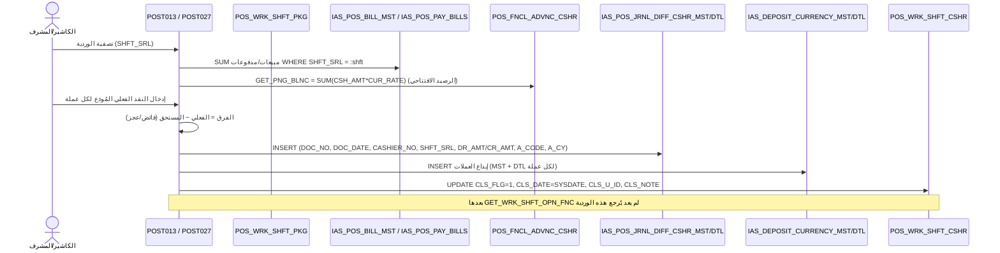

# FLOW_CLOSE_SHIFT — إقفال الوردية والمطابقة (End‑to‑End)

> **proof:** `docs/screens/POST027.md` (ورديات العمل) + `POST013.md` (تصفية مبيعات الكاشيرات) + `POST015.md` (فائض وعجز مبيعات الكاشيرات) + `POST012.md` (ملخص مبيعات الكاشيرات) · `PKG_POS_WRK_SHFT_PKG.sql` · `db/schema/tables/POS_WRK_SHFT_CSHR.sql` + `IAS_POS_JRNL_DIFF_CSHR_MST.sql`/`_DTL.sql` + `IAS_DEPOSIT_CURRENCY_MST.sql`.

---

## 1. نظرة عامة

إقفال الوردية يتمّ بـ **«تصفية مبيعات الكاشيرات»** (POST013) أو زر «إغلاق» في POST027 (بشرط عدم تفعيل
«عدم السماح بالبيع في حالة عدم تصفية المبيعات»). الإقفال: يجمع مبيعات الوردية، يطابق النقد الفعلي
المُودَع مقابل المستحق، يسجّل **الفروقات (فائض/عجز)** في `IAS_POS_JRNL_DIFF_CSHR_MST/DTL`، يُودِع
العملات في `IAS_DEPOSIT_CURRENCY_MST/DTL`، ثم يضبط `POS_WRK_SHFT_CSHR.CLS_FLG=1, CLS_DATE=SYSDATE`.

```
POST013 تصفية → جمع مبيعات الوردية (IAS_POS_BILL_MST/PAY_BILLS WHERE SHFT_SRL)
  → المستحق النقدي = Σ المبيعات النقدية + الرصيد الافتتاحي (POS_FNCL_ADVNC_CSHR)
  → الفعلي المُودَع (إدخال الكاشير)
  → الفرق = الفعلي − المستحق → IAS_POS_JRNL_DIFF_CSHR (فائض/عجز)
  → إيداع العملات → IAS_DEPOSIT_CURRENCY_MST/DTL
  → CLS_FLG=1, CLS_DATE, CLS_U_ID على POS_WRK_SHFT_CSHR
```

---

## 2. مخطّط Mermaid (sequence)



---

## 3. جدول الخطوات

| # | الخطوة | الواجهة | المنطق | الجدول → الأعمدة الحقيقية |
|---|--------|---------|--------|----------------------------|
| 1 | جمع مبيعات الوردية | POST012/POST013 | `SELECT ... WHERE SHFT_SRL=:1` | `IAS_POS_BILL_MST` (تجميع `BILL_AMT/PAYED_AMT`)؛ `IAS_POS_PAY_BILLS (SHFT_SRL, PAY_AMT, PAY_CUR)` |
| 2 | الرصيد الافتتاحي | — | `GET_PNG_BLNC(SHFT_SRL) = SUM(CSH_AMT*CUR_RATE)` | `POS_FNCL_ADVNC_CSHR (SHFT_SRL, CSH_AMT, CUR_RATE)` |
| 3 | النقد الفعلي | إدخال يدوي لكل عملة | — | `IAS_DEPOSIT_CURRENCY_DTL` |
| 4 | حساب الفرق | POST015 (فائض/عجز) | `الفرق = الفعلي − المستحق` | `IAS_POS_JRNL_DIFF_CSHR_DTL (DR_AMT, CR_AMT)` |
| 5 | تسجيل الفروقات | — | إدراج مستند فروقات | **`IAS_POS_JRNL_DIFF_CSHR_MST`**: `DOC_NO, DOC_DATE, DOC_SER, PROCESS`؛ **`_DTL`**: `DOC_NO, MACHINE_NO, A_CODE, A_CY, DR_AMT, CR_AMT, AC_RATE, CASHIER_NO, SHFT_SRL, J_DOC_NO, J_DOC_SER, NET_AMT_SAL, NET_AMT_VAL, CR_CARD_NO, AC_CODE_DTL` |
| 6 | إيداع العملات | — | إدراج إيداع | **`IAS_DEPOSIT_CURRENCY_MST`** + **`_DTL`** (مبلغ/عملة/سعر لكل عملة) |
| 7 | **الإقفال** | زر «إغلاق» (alert `CLOSE_SHFT`) | `UPDATE POS_WRK_SHFT_CSHR SET CLS_FLG=1, CLS_DATE, CLS_U_ID` | **`POS_WRK_SHFT_CSHR`**: `CLS_FLG, CLS_DATE, CLS_U_ID, CLS_NOTE, CLS_TIME` |
| 8 | منع البيع بعد الإقفال | — | `GET_WRK_SHFT_OPN_FNC` يتوقف عن إرجاع `SHFT_SRL` | `CLS_DATE IS NOT NULL` |

---

## 4. ملاحظات لإعادة البناء
1. **التصفية شرط الإقفال** (إن فُعّل المتغير) — اجمع مبيعات الوردية ثم طابق قبل السماح بـ `CLS_FLG=1`.
2. **مستند الفروقات (`JRNL_DIFF`)** = قيد فائض/عجز: `DR_AMT`/`CR_AMT` حسب اتجاه الفرق، مربوط بـ `CASHIER_NO` + `SHFT_SRL`. صمّمه كـ `ShiftReconciliation` بسطور لكل عملة.
3. **إيداع متعدد العملات** (`IAS_DEPOSIT_CURRENCY_MST/DTL`) بسعر صرف لكل عملة.
4. **الإقفال يحجب البيع** — يقابل `GET_WRK_SHFT_OPN_FNC` (CLS_DATE IS NULL). افرضه في الـ domain.
5. التقارير المرتبطة: POST012 (ملخص)، POST013 (تصفية)، POST015 (فائض/عجز) → انظر FLOW_REPORTS.
6. الإيداع/الفروقات تُرحَّل للمركز عبر `MOV_CASHIER_DEPOSIT_PRC` / `MOV_BILLS_DIFF_PRC` (FLOW_SYNC).

## 5. ثغرات
- جداول `POS_WRK_SHFT_CSHR`, `IAS_POS_JRNL_DIFF_CSHR_*`, `IAS_DEPOSIT_CURRENCY_*` **فارغة** (0 صف) → لا golden؛ المنطق من الأعمدة + الشاشات.
- معادلة المستحق الدقيقة (كيف يُجمع النقد مقابل الشبكة/الآجل) ومنطق القيد المحاسبي (`A_CODE`, `J_DOC_NO`) يحتاجان تتبّع داخل أكواد POST013/POST015 (p‑code) أو screenshots للتدفّق.
- ربط الحساب المحاسبي (`A_CODE`/`INTERFACE_ACC`) في المخطط المركزي.
