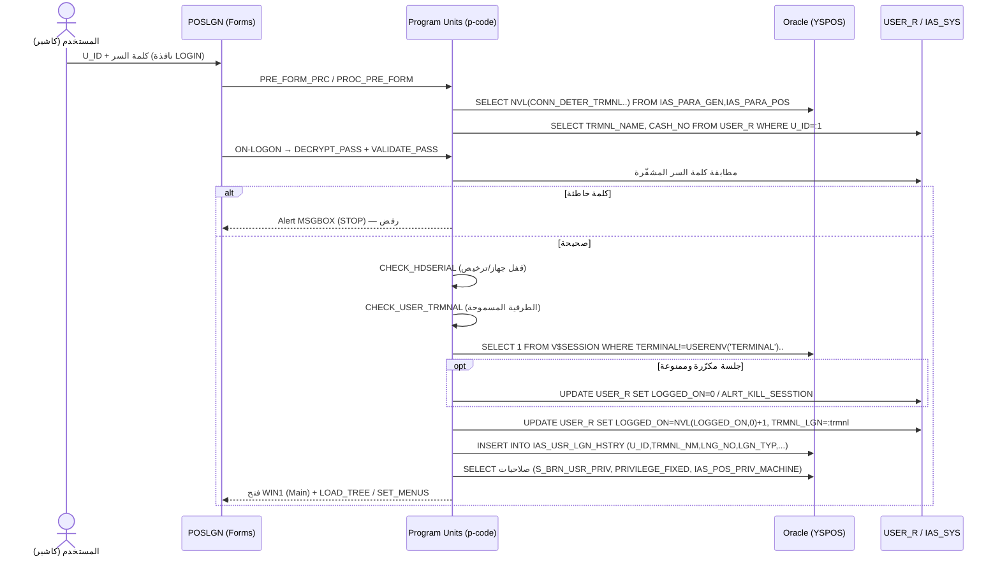

# FLOW_LOGIN — تسجيل الدخول (End‑to‑End)

> **المنهج:** proof-not-assumption. كل اسم حقل/إجراء/جدول مُستخرَج فعلياً من
> `docs/screens/POSLGN.md` + `docs/screens/_raw/POSLGN_strings.txt` + `db/schema/tables/*.sql`.
> **الشاشة:** `POSLGN` (Login، 644,808 bytes، فُكّت بـ witchi ✅).

---

## 1. نظرة عامة

تسجيل الدخول في Onyx POS يتمّ على مستوى **Oracle Forms client** (شاشة POSLGN) وليس في حزمة DB
مركزية — دوال التحقق (`DECRYPT_PASS`, `VALIDATE_PASS`, `CHECK_HDSERIAL`, `ENCRYPT_PASS`,
`CHECK_USER_TRMNAL`) هي **Program Units داخل الـ .fmx** (p‑code؛ أسماؤها مُستخرجة من strings،
أجسامها غير قابلة للاسترجاع). جدول المستخدمين `USER_R` يقع في المخطط المركزي `IAS202623`
(synonym؛ غائب في النسخة المعزولة — انظر §6 ثغرات).

```
المستخدم يُدخل (U_ID + كلمة سر) في نافذة LOGIN (modal)
   → PRE-LOGON / ON-LOGON triggers
   → DECRYPT_PASS (فكّ تشفير السر المخزّن) + VALIDATE_PASS (مطابقة)
   → CHECK_HDSERIAL (قفل الجهاز/الترخيص) + CHECK_USER_TRMNAL (الطرفية المسموحة)
   → فحص الجلسات المتزامنة (V$SESSION) وقفل تسجيل دخول مكرّر
   → تحديث USER_R (LOGGED_ON, TRMNL_LGN, LOGIN/LOGOUT)
   → INSRT_INTO_LGN_HSTY_PRC → IAS_USR_LGN_HSTRY
   → تحميل الصلاحيات (S_BRN_USR_PRIV, PRIVILEGE_FIXED, IAS_POS_PRIV_MACHINE)
   → فتح الشاشة الرئيسية (WIN1) + LOAD_TREE/LOAD_FAV_SCR
```

---

## 2. مخطّط Mermaid (sequence)



---

## 3. جدول الخطوات (الواجهة → المنطق → الجدول → الأعمدة الحقيقية)

| # | الواجهة (POSLGN) | المنطق (Program Unit / SQL حقيقي) | الجدول | الأعمدة الحقيقية |
|---|------------------|-----------------------------------|--------|-------------------|
| 1 | بلوك `LOGIN` (window LOGIN, DIALOG modal): حقل المستخدم + كلمة السر | `PRE_FORM_PRC`, `POS_PARAMETERS`, `GET_TERMINAL_DFLT` | `IAS_PARA_GEN`, `IAS_PARA_POS` | `CONN_DETER_TRMNL`, `CONN_NOT_MORE_ONE`, `OPEN_SYS_MORE_ONE` |
| 2 | إدخال اسم المستخدم | `SELECT TRMNL_NAME FROM USER_R WHERE U_ID` ؛ `SELECT CASH_NO FROM USER_R WHERE U_ID=:b1` | `USER_R` | `U_ID`, `TRMNL_NAME`, `CASH_NO`, `U_A_NAME`, `U_E_NAME`, `TRMNL_LGN`, `LOGGED_ON`, `LOGIN`, `LOGOUT` |
| 3 | إدخال كلمة السر | `DECRYPT_PASS` (p-code) ← يُفكّ السر المخزّن؛ `VALIDATE_PASS` يطابق؛ `ENCRYPT_PASS` للتخزين عند التغيير (`ALTER_PASS`) | `USER_R` | (عمود كلمة السر المشفّرة) |
| 4 | فحص الترخيص/الجهاز | `CHECK_HDSERIAL` (p-code) — يربط دخول المستخدم بالـ HD serial/الترخيص | `IAS_SYS`, `IAS_POS_MACHINE` | `IAS_SYS.S_TRMNLS_AUTHRTY (SERVER_NO, SERVER_NAME, TRMNL_NAME)`, `IAS_POS_MACHINE.TERMINAL` |
| 5 | منع تكرار الجلسة | `SELECT 1 FROM V$SESSION WHERE TERMINAL != USERENV('TERMINAL') AND SCHEMANAME = 'YSPOS'\|\|:b1` ؛ `SELECT COUNT(*) FROM V$SESSION WHERE UPPER(CLIENT_IDENTIFIER)=:b1` | `V$SESSION`, `USER_R` | `SID`, `SERIAL#`, `CLIENT_IDENTIFIER`, `STATUS` |
| 6 | تسجيل دخول ناجح | `UPDATE USER_R SET LOGGED_ON=NVL(LOGGED_ON,0)+1, TRMNL_LGN=..` (وعكسها عند الخروج: `LOGGED_ON-1, TRMNL_LGN=NULL, LOGOUT=..`) | `USER_R` | `LOGGED_ON`, `TRMNL_LGN`, `LOGOUT` |
| 7 | سجل الدخول | `INSRT_INTO_LGN_HSTY_PRC` → `INSERT INTO IAS_USR_LGN_HSTRY (U_ID,TRMNL_NM,LNG_NO,LGN_TYP,LGN_OUT_DATE,CMP_NO,BRN_NO,BRN_YEAR,BRN_USR)` | **`IAS_USR_LGN_HSTRY`** (608 صف حي) | `U_ID, TRMNL_NM, LNG_NO, LGN_TYP, LGN_OUT_DATE, CMP_NO, BRN_NO, BRN_YEAR, BRN_USR` |
| 8 | تحميل الصلاحيات + الشجرة | `LOAD_TREE`, `SET_MENUS`, `CALL_FAV_SCR`, `LOAD_FAV_SCR` | `S_BRN_USR_PRIV`, `PRIVILEGE_FIXED`, `IAS_POS_PRIV_MACHINE`, `FORM_DETAIL` | `S_BRN_USR_PRIV (U_ID,BRN_NO,VIEW_FLAG)`, `PRIVILEGE_FIXED (U_ID, OPN_SYS_MORE_ONCE, USER_VIEW_DOC_ENTR)` |
| 9 | اللغة/الفرع | `CHECK_LANG`, `CHECK_DB_BRANCH` | `IAS_SYS`, `S_BRN`, `LANG_DEF` | `IAS_SYS (LANG_NO, LANG_NAME, CAPTION_DET)`, `S_BRN (BRN_NO, BRN_LNAME, BRN_FNAME, CMP_GRP)` |

> **بصمة الإصبع:** الشاشة تحوي حزمة `FINGER_PKG` + `ZKFPENGXCONTROL_*` (جهاز ZKTeco) — دخول بالبصمة عبر `FNGR_CALL_PRC`/`USER_FNGR`.

---

## 4. الجداول والأعمدة المرجعية (proof من DDL/strings)

- **`USER_R`** (المخطط المركزي، synonym): `U_ID, U_A_NAME, U_E_NAME, TRMNL_NAME, TRMNL_LGN, CASH_NO, LOGGED_ON, LOGIN, LOGOUT`.
- **`IAS_USR_LGN_HSTRY`** (محلي، 608 صف): سجل كل دخول/خروج.
- **`IAS_POS_MACHINE`**: `MACHINE_NO, TERMINAL, BRN_MACHINE_NO, CURR_DFLT, SI_TYPE` (ربط الطرفية بالجهاز).
- صلاحيات: `S_BRN_USR_PRIV`, `PRIVILEGE_FIXED`, `IAS_POS_PRIV_MACHINE`, `IAS_SHW_DOC_PRIV`.

---

## 5. ملاحظات لإعادة البناء (Motech POS الجديد)

1. **التشفير:** Onyx يخزّن كلمة السر مشفّرة بخوارزمية خاصة (`ENCRYPT_PASS`/`DECRYPT_PASS` غير متاحة المصدر).
   النظام الجديد **لا يعيد إنتاج** هذا — استخدم **bcrypt/argon2** + JWT (HS256 access+refresh) كما هو
   منفّذ فعلاً في `backend/src/modules/auth` (مخزن مستخدمين محلي مؤقّت). موثّق في `docs/db/AUTH_DATA_NOTE.md`.
2. **منع تكرار الجلسة** (`CONN_NOT_MORE_ONE`/`OPEN_SYS_MORE_ONE`): يُمثَّل بسياسة جلسة واحدة فعّالة لكل
   مستخدم (refresh-token rotation + قائمة جلسات نشطة) بدل `V$SESSION`.
3. **سجل الدخول** (`IAS_USR_LGN_HSTRY`) → جدول `login_history` (audit) مع `terminal, lang, type, time`.
4. **ربط الطرفية بالجهاز** (`USER_R.TRMNL_NAME`/`IAS_POS_MACHINE.TERMINAL`): في PWA يُستبدَل بـ
   **device registration / machine token** لكل نقطة بيع.
5. **الصلاحيات (RBAC):** Onyx يخلط fixed privileges + branch privileges + screen privileges؛ النظام
   الجديد يبسّطها إلى أدوار (`cashier`/`supervisor`/`admin`) عبر `RolesGuard` (منفّذ).
6. **CASH_NO** (رقم صندوق المستخدم) و**العملة الافتراضية** (machine) شرطان لفتح شاشة البيع — يجب التحقق
   منهما بعد الدخول مباشرة (تنبيه «أدخل رقم حساب الصندوق» / «أدخل عملة البيع الافتراضية»).

## 6. ثغرات تحتاج IAS202623 أو screenshots
- **`USER_R` (synonym → IAS202623 غائب):** أعمدة كلمة السر/الصلاحيات الفعلية غير مرئية → تأكيد بنية الصلاحيات يحتاج المخطط المركزي.
- **أجسام `DECRYPT_PASS`/`VALIDATE_PASS`/`CHECK_HDSERIAL`** = p‑code في الـ .fmx (غير قابلة للاسترجاع) → خوارزمية التشفير غير معروفة (لا حاجة لها في إعادة البناء).
- **تخطيط النافذة وتسميات الحقول العربية** = screenshots (الـ items لا تُطبع في CLI).
