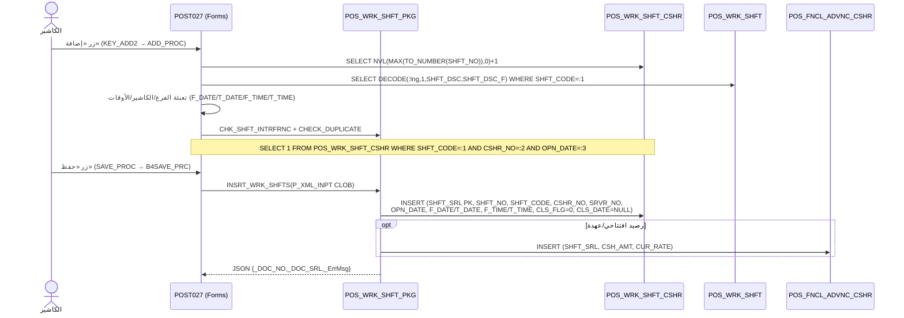

# FLOW_OPEN_SHIFT — فتح وردية العمل (End‑to‑End)

> **proof:** `docs/screens/POST027.md` (+`_raw/POST027_strings.txt`) + `db/schema/plsql/PKG_POS_WRK_SHFT_PKG.sql` + `db/schema/tables/POS_WRK_SHFT_CSHR.sql` / `POS_WRK_SHFT.sql`.
> **الشاشة:** `POST027` — «ورديات العمل» (POS > عمليات النظام). تظهر فقط إن فُعّل متغير «استخدام ورديات العمل».

---

## 1. نظرة عامة

الوردية **شرط مسبق للبيع**: لا تُفتح فاتورة دون `SHFT_SRL` مفتوح للكاشير. عند النقر على «إضافة» في
POST027، يُولّد النظام رقم وردية تسلسلياً، يعبّئ الفرع/الكاشير/كود الوردية/الأوقات، ثم يُدرج صفاً في
`POS_WRK_SHFT_CSHR` عبر `INSRT_WRK_SHFTS(P_XML_INPT)`. ورديتان: **معرّفة** (من `POS_WRK_SHFT`) أو
**متغيرة** (الأوقات/الكود يدوياً).

```
POST027 «إضافة» → ADD_PROC/ADD_PROC2
  → SHFT_NO = MAX(SHFT_NO)+1            (من POS_WRK_SHFT_CSHR)
  → الفرع/الكاشير من المستخدم الداخل   (USER_R.CASH_NO / IAS_POS_MACHINE)
  → كود الوردية + الوصف + الأوقات       (POS_WRK_SHFT للمعرّفة / يدوي للمتغيرة)
  → فحص التداخل CHK_SHFT_INTRFRNC + CHECK_DUPLICATE
  → SAVE → INSRT_WRK_SHFTS(XML) → POS_WRK_SHFT_CSHR (CLS_FLG=0, CLS_DATE=NULL)
  → (اختياري) رصيد افتتاحي/عهدة → POS_FNCL_ADVNC_CSHR
```

---

## 2. مخطّط Mermaid (sequence)



---

## 3. جدول الخطوات

| # | الواجهة (POST027) | المنطق (proc/SQL حقيقي) | الجدول | الأعمدة الحقيقية |
|---|-------------------|--------------------------|--------|-------------------|
| 1 | فحص تفعيل الورديات | `LOAD_PARAMETERS` → `SELECT NVL(USE_WRK_SHFT,0),NVL(WRK_SHFT_TYP,0),NVL(OPN_SHFT_TYP,0) FROM IAS_PARA_POS` | `IAS_PARA_POS` | `USE_WRK_SHFT, WRK_SHFT_TYP, OPN_SHFT_TYP` |
| 2 | رقم الوردية (آلي) | `SELECT NVL(MAX(TO_NUMBER(SHFT_NO)),0)+1 FROM POS_WRK_SHFT_CSHR` | `POS_WRK_SHFT_CSHR` | `SHFT_NO`, `SHFT_SRL` (PK) |
| 3 | الكاشير/الجهاز | `SELECT CASH_NO FROM USER_R WHERE U_ID=:b1` ؛ `SELECT CASH_NO_CNCT, MACHINE_NO FROM IAS_POS_MACHINE WHERE UPPER(TERMINAL)=UPPER(:b1)` | `USER_R`, `IAS_POS_MACHINE` | `CASH_NO`, `MACHINE_NO`, `TERMINAL` |
| 4 | كود/وصف الوردية (معرّفة) | `SELECT DECODE(:b1,1,SHFT_DSC,SHFT_DSC_F) FROM POS_WRK_SHFT WHERE SHFT_CODE=:1` | `POS_WRK_SHFT` | `SHFT_CODE` (PK), `SHFT_DSC, SHFT_DSC_F, ALLW_PRD_BFR, ALLW_PRD_AFTR, F_TIME, T_TIME, F_DATE, T_DATE, INACTIVE` |
| 5 | فحص التداخل/التكرار | `CHK_SHFT_INTRFRNC` ؛ `SELECT 1 FROM POS_WRK_SHFT_CSHR WHERE SHFT_CODE=:1 AND CSHR_NO=:2 AND OPN_DATE=TO_DATE(:3,'DD/MM/YYYY')` | `POS_WRK_SHFT_CSHR` | `SHFT_CODE, CSHR_NO, OPN_DATE` |
| 6 | منع فتح وعليه بيانات | `select 1 from ias_pos_bill_mst where RowNum<=1 And Shft_srl=..` | `IAS_POS_BILL_MST` | `SHFT_SRL` |
| 7 | **الحفظ** | `PKG_POS_WRK_SHFT_PKG.INSRT_WRK_SHFTS(P_XML_INPT CLOB)` | **`POS_WRK_SHFT_CSHR`** | `SHFT_SRL, SHFT_NO, SHFT_CODE, SHFT_DSC, SHFT_DSC_F, SHFT_DATE, SHFT_TIME, CSHR_NO, SRVR_NO, OPN_DATE, OPN_TIME, F_DATE, T_DATE, F_TIME, T_TIME, CLS_FLG=0, CLS_DATE=NULL, INTRFRNC_FLG, CMP_NO, BRN_NO` |
| 8 | عهدة/رصيد افتتاحي | (عند الإقفال يُحسب عبر) `GET_PNG_BLNC(P_SHFT_SRL)` = `SUM(CSH_AMT*CUR_RATE) FROM POS_FNCL_ADVNC_CSHR WHERE SHFT_SRL=?` | `POS_FNCL_ADVNC_CSHR` | `SHFT_SRL, CSH_AMT, CUR_RATE` |

---

## 4. شرط البيع (التحقق من وردية مفتوحة)

`GET_WRK_SHFT_OPN_FNC(P_CSHR_NO)` (في `PKG_POS_WRK_SHFT_PKG`) — يُرجع:
```
MIN(SHFT_SRL) FROM POS_WRK_SHFT_CSHR
 WHERE CSHR_NO = P_CSHR_NO AND CLS_DATE IS NULL AND CLS_FLG = 0
   AND SYSDATE BETWEEN (F_DATE+F_TIME) AND (T_DATE+T_TIME)
   AND NOT EXISTS (إيداع عملة في IAS_DEPOSIT_CURRENCY_MST)
```
دوال مساندة: `CHK_WRK_SHFT_CSHR_FNC` (هل للكاشير وردية مفتوحة)، `GET_USD_WRK_SHFT_FNC(P_MCHN_NO)`.

---

## 5. ملاحظات لإعادة البناء

1. **الوردية شرط صارم للبيع** — في الـ domain، رفض `PostBill` إن لم يوجد `SHFT_SRL` مفتوح
   (يقابل `GET_WRK_SHFT_OPN_FNC`). الـ backend يُرجع `409 no-open-shift` (RFC 9457) — منفّذ في `shifts/current`.
2. **نوعا الوردية:** معرّفة (`POS_WRK_SHFT` بأوقات + `ALLW_PRD_BFR/AFTR`) أو متغيرة (وقت الدخول = البداية، بلا نهاية).
3. **الترقيم:** `SHFT_SRL` PK (تسلسل عام)، `SHFT_NO` = MAX+1 لكل كاشير. كرّرها بـ sequence/serial في DB الجديد.
4. **الإقفال** (FLOW_CLOSE_SHIFT) يضبط `CLS_FLG=1, CLS_DATE` + إيداع العملة + الفروقات.
5. **فحص التداخل** (`CHK_SHFT_INTRFRNC` / `INTRFRNC_FLG`): امنع ورديتين متداخلتين زمنياً لنفس الكاشير.
6. **READ-ONLY الحالي:** فتح/إقفال الوردية (كتابة) مؤجَّل لمرحلة الكتابة في الـ backend؛ نُفّذ جانب القراءة فقط.

## 6. ثغرات
- جداول الورديات **فارغة** (0 صف) في النسخة الحالية → لا golden data لفتح/إقفال؛ المنطق مُثبَت من الكود فقط.
- بنية XML الإدخال لـ `INSRT_WRK_SHFTS` تحتاج تتبّع داخل `PKG_POS_WRK_SHFT_PKG` (عناصر العهدة/الفروع) — تفاصيل العهدة قد تحتاج screenshots لشاشة POST014 (Cashiers' Financial Custodies).
