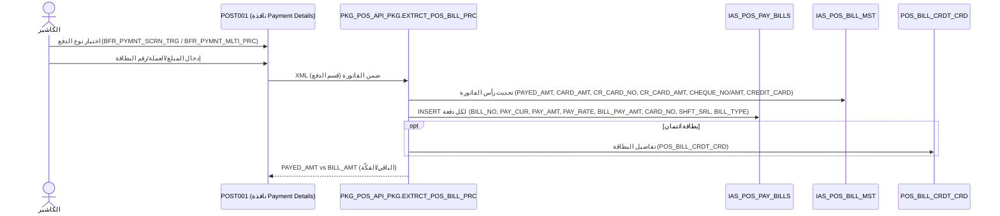

# FLOW_PAYMENT — الدفع (End‑to‑End)

> **proof:** `docs/screens/POST011.md`/`POST010.md`/`POST006.md` (+strings) · `PKG_POS_API_PKG.sql` (قسم الدفع داخل `EXTRCT_POS_BILL_PRC`) · `db/schema/tables/IAS_POS_PAY_BILLS.sql` · `IAS_POS_BILL_MST.sql` (حقول البطاقات/الشيك).
> **الشاشات:** الدفع مدمج في POST001 (canvases `MAIN_PYMNT_CSH/VISA/CRDT/RPLC/CPN/...`)؛ شاشات تحصيل مستقلة: `POST011` (IAS_POS_PAY_BILLS)، `POST010` (Cash Payment for Invoices)، `POST006` (الدفع النقدي للمرتجعات).

---

## 1. نظرة عامة

الدفع يُرسَل ضمن **نفس XML الفاتورة** إلى `EXTRCT_POS_BILL_PRC` (قسم الدفع)، فيُكتب في
**`IAS_POS_PAY_BILLS`** (دفعة واحدة أو أكثر: عملات/بطاقات متعددة) + حقول الدفع في رأس
`IAS_POS_BILL_MST` (`PAYED_AMT, CARD_AMT, CR_CARD_*, CHEQUE_*, CREDIT_CARD`). النقد عبر
`IAS_POS_PAY_CASH`؛ بطاقات الائتمان تفاصيلها في `POS_BILL_CRDT_CRD`. الفواتير اللحظية: `IAS_POS_PAY_RT_BILLS`.

أنواع الدفع المرئية في POST001 (من canvases الدفع):
`CSH` نقد · `VISA` بطاقة بنكية · `CRDT` آجل/ائتمان · `RPLC` استبدال نقاط · `CPN`/`CPNAR` كوبون · `AC` حساب · `ASSCTN_TRNS` حركة جمعية · `POINT_RPLC` استبدال نقاط.

---

## 2. مخطّط Mermaid (sequence)

---

## 3. جدول الخطوات

| # | نوع الدفع | الواجهة (canvas/trigger) | المنطق | الجدول → الأعمدة الحقيقية |
|---|-----------|--------------------------|--------|----------------------------|
| 1 | عام | `MAIN8 Payment Details` + `DMY_PYMNT`/`MAIN_CALC_BLK`؛ trigger `BFR_PYMNT_SCRN_TRG`, `BFR_PYMNT_MLTI_PRC` | `EXTRCT_POS_BILL_PRC` (قسم الدفع) | **`IAS_POS_PAY_BILLS`**: `BILL_NO, BILL_SRL, BILL_DATE, MACHINE_NO, PAY_CUR, PAY_AMT, PAY_RATE, BILL_PAY_AMT, RT_BILL_NO, CARD_NO, BILL_TYPE, C_CODE, SHFT_SRL, DOC_POST, DOC_PST_SQ, DOC_BRN_NO, DB_LINK_NM` |
| 2 | نقد (CSH) | canvas `MAIN_PYMNT_CSH` (block `IAS_POS_PAY_BILLS_CSH`) | — | `IAS_POS_PAY_CASH`؛ `IAS_POS_BILL_MST.PAYED_AMT, CASH_NO` |
| 3 | بطاقة/شبكة (VISA) | canvas `MAIN_PYMNT_VISA` (hidden افتراضياً)؛ تنبيه `AL_BNK_MCHN` | `CR_CRD_PKG` | `IAS_POS_BILL_MST.CARD_AMT, CREDIT_CARD, CR_CARD_NO, CR_CARD_AMT, CR_BANK_NO, CR_VALUE_DATE, CR_CARD_DSC` (+ scnd/thrd)؛ `POS_BILL_CRDT_CRD`؛ مرجع `CREDIT_CARD_TYPES` |
| 4 | شيك (Cheque) | (حقول الرأس) | — | `IAS_POS_BILL_MST.CHEQUE_NO, CHEQUE_AMT, CHEQUE_DUE_DATE` |
| 5 | آجل/ائتمان (CRDT) | canvas `MAIN_PYMNT_CRDT`؛ `CHECK_CREDIT_LIMIT`, `AL_CR_LIMIT` | `CHECK_CREDIT_LIMIT` | `CUSTOMER`/`IAS_CASH_CUSTMR` (حدّ الائتمان)؛ `IAS_POS_PAY_BILLS.C_CODE` |
| 6 | استبدال نقاط (RPLC/POINT_RPLC) | canvas `MAIN_PYMNT_RPLC`/`MAIN_PYMNT_POINT_RPLC` (block `IAS_POS_PAY_BILLS_RPLC`) | `POS_POINT_PKG.Get_Point_Rplc_Amt` | `IAS_POS_BILL_MST.POINT_RPLC_AMT, POINT_TYP_NO` (انظر FLOW_LOYALTY) |
| 7 | كوبون (CPN) | canvas `MAIN_PYMNT_CPN`/`CPNAR` (block `IAS_POS_PAY_BILLS_CPN`, `POS_BILL_CPN`)؛ `AL_CPN`, `AL_CPN_AMT` | `CPN_PKG` | `POS_BILL_CPN`, `IAS_CPN_DTL` |
| 8 | عملات متعددة | تكرار صفوف الدفع | — | `IAS_POS_PAY_BILLS (PAY_CUR, PAY_RATE)` لكل عملة؛ `EX_RATE.CUR_RATE_POS` |

---

## 4. منطق الدفع المتعدد (proof)
- **رأس الفاتورة** يحمل ملخّص الدفع (`PAYED_AMT`, `CARD_AMT`, حتى 3 بطاقات `CR_CARD_NO/AMT[_SCND/_THRD]`, شيك واحد).
- **`IAS_POS_PAY_BILLS`** يحمل **سطر دفع لكل عملة/بطاقة** (تفصيلي) مع `PAY_CUR/PAY_AMT/PAY_RATE` و`BILL_PAY_AMT` (بعملة الفاتورة) و`SHFT_SRL` (ربط الوردية).
- `BILL_TYPE` يميّز فاتورة بيع/مرتجع؛ `DOC_POST/DOC_PST_SQ` لحالة الترحيل.

---

## 5. ملاحظات لإعادة البناء
1. **نموذج دفع متعدد:** صمّم `Payment` كقائمة سطور (method, currency, amount, rate, cardRef) مرتبطة بالفاتورة + بالوردية (`SHFT_SRL`). الإجمالي المدفوع = Σ سطور بعملة الفاتورة.
2. **NUMERIC للمال** (لا float) — منفّذ كـ `Money` (minor units) في الـ domain.
3. **حدّ الائتمان** (`CHECK_CREDIT_LIMIT`) قبل قبول دفع آجل.
4. **سعر الصرف** من `EX_RATE.CUR_RATE_POS` وقت الدفع — خزّن `PAY_RATE` لكل سطر للتدقيق.
5. **الفكّة/الباقي** = `PAYED_AMT − BILL_AMT` (يُعرض، لا يُخزَّن كقيمة سالبة).
6. النقد، البطاقة، الآجل، الكوبون، الاستبدال = strategies تحت نفس الـ port.

## 6. ثغرات
- `IAS_POS_PAY_BILLS` فيه **صف واحد فقط** حياً؛ `POS_BILL_CRDT_CRD`/`IAS_POS_PAY_CASH` فارغة → لا golden للدفع المتعدد؛ المنطق من الأعمدة + الشاشة.
- تفاصيل بنية XML لقسم الدفع داخل `EXTRCT_POS_BILL_PRC` تحتاج تتبّعاً أعمق في `PKG_POS_API_PKG` (أسماء عناصر XML الدقيقة للبطاقات/الشيك).
- مرجع البنوك/أنواع البطاقات (`CREDIT_CARD_TYPES`, `IAS_COMM_CR_CARD_BANK`) في المخطط المركزي.
