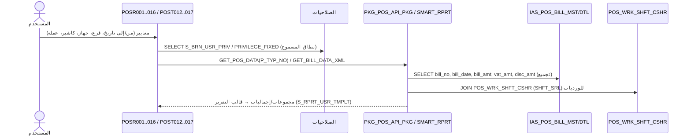

# FLOW_REPORTS — التقارير الرئيسية (End‑to‑End)

> **proof:** `docs/screens/POSR001..016.md` + شاشات الحركة التقريرية `POST012/013/015/017/021` (+strings) · `db/schema/plsql/PKG_POS_API_PKG.sql` (`GET_POS_DATA`, `GET_BILL_DATA_XML`) · `PKG_POS_SMART_RPRT_PKG` · `db/schema/tables/IAS_POS_BILL_MST.sql`/`_DTL.sql`.

---

## 1. نظرة عامة

التقارير نوعان:
1. **تقارير POSR** (16 شاشة): قوالب Oracle Reports تعتمد قوالب المستخدم `S_RPRT_USR_TMPLT_MST/_DTL`
   وصلاحيات (`S_BRN_USR_PRIV`, `IAS_POS_PRIV_MACHINE`, `PRIVILEGE_*`). معظمها يستعلم `IAS_POS_BILL_MST/DTL`
   و`POS_WRK_SHFT_CSHR` مع تجميعات.
2. **شاشات حركة تقريرية POST** (012/013/015/017/021): تجميع مبيعات/فروقات/حركة فواتير ونقاط للورديات.

الدوال المركزية لإخراج البيانات: `GET_POS_DATA(P_TYP_NO)` (1=SALES, 2=RT SALES, 3=NET SALES)،
`GET_BILL_DATA_XML`/`GET_RT_BILL_DATA_XML` (للطباعة/الاسترجاع)، `FUNC_GET_POS_NET_SALE_QTY` (صافي كمية صنف).

---

## 2. مخطّط Mermaid (sequence)

---

## 3. جدول التقارير (الشاشة → الوظيفة → الجداول/التجميعات الحقيقية)

| الشاشة | الوظيفة | الجداول الرئيسية (proof) | التجميع/الإخراج |
|--------|---------|---------------------------|------------------|
| **POSR001** | تقرير الورديات/المبيعات للكاشير | `POS_WRK_SHFT_CSHR`, `IAS_POS_PAY_BILLS`, `IAS_CASH_CUSTMR`, `USER_R`؛ `SELECT bill_no,bill_date,bill_time,flg_desc bill_type,a_cy,bill_amt,disc_amt FROM ias_pos_bill_mst,s_flags` (+ نظير RT) | فواتير الوردية + الأنواع |
| POSR002 | عملاء/مبيعات نقاطية | `IAS_CASH_CUSTMR`, `POS_WRK_SHFT_CSHR`, `IAS_PRIV_CUSTOMER` | حسب العميل |
| POSR003/008/012/016 | قوالب تقارير مستخدم | `S_RPRT_USR_TMPLT_MST/_DTL`, `USER_R` | قوالب قابلة للتخصيص |
| POSR004/014 | تقارير الورديات | `POS_WRK_SHFT_CSHR`, `IAS_POS_PRIV_MACHINE` | حسب الوردية |
| POSR005/006/010/011 | تقارير حسب المستخدم | `USER_R`, `S_RPRT_USR_TMPLT_*`, `IAS_POS_BILL_MST` | حسب المستخدم |
| POSR007/015 | صلاحيات الفروع | `S_BRN_USR_PRIV` | حسب الفرع |
| POSR009 | تقارير الأجهزة | `IAS_POS_MACHINE`, `EX_RATE`, `VAOUCHER` | حسب الجهاز |
| POSR013 | تقارير الأصناف | `IAS_ITM_MST` *(synonym→IAS202623)*, `IAS_CASH_CUSTMR_GRP` | حسب الصنف |
| **POST012** | ملخص مبيعات الكاشيرات | `IAS_POS_BILL_MST`, `IAS_POS_PAY_BILLS (SHFT_SRL)` | Σ مبيعات/كاشير |
| **POST013** | تصفية مبيعات الكاشيرات | `POS_WRK_SHFT_CSHR`, `IAS_POS_PAY_BILLS`, `POS_FNCL_ADVNC_CSHR` | المستحق مقابل الفعلي (FLOW_CLOSE_SHIFT) |
| **POST015** | فائض وعجز الكاشيرات | `IAS_POS_JRNL_DIFF_CSHR_MST/_DTL` | DR_AMT/CR_AMT |
| **POST017** | استعراض حركة الفواتير | `IAS_POS_BILL_MST/DTL`, `IAS_POS_HST_BILL_MST` | تتبّع الفاتورة |
| **POST021** | استعراض حركة النقاط | `Pos_Point_Calc_trns` (FLOW_LOYALTY) | حركة النقاط |

---

## 4. دوال الإخراج المركزية (proof من PKG_POS_API_PKG)
- `GET_POS_DATA(P_TYP_NO)` — `1=SALES, 2=RT SALES, 3=NET SALES`.
- `GET_BILL_DATA_XML` / `GET_BILL_MST_XML` / `GET_BILL_DTL_XML` / `GET_RT_BILL_DATA_XML` — بيانات الفاتورة كـ XML/CLOB للطباعة.
- `FUNC_GET_POS_NET_SALE_QTY` — صافي كمية مبيعات الصنف.
- `FUNC_TAFKEET` / `FUNC_TAFKEET_F` — تفقيط المبلغ (عربي/أجنبي) للطباعة.
- `PKG_POS_SMART_RPRT_PKG` — التقارير الذكية.

---

## 5. ملاحظات لإعادة البناء
1. **تقرير يومي (KPIs)** منفّذ فعلاً في الـ backend: `GET /reports/summary/daily` (تجميع `IAS_POS_BILL_MST` — 47 يوم، 2026-06-24: 464 فاتورة، 169,377). يقابل `GET_POS_DATA(1)`.
2. **أنواع البيانات الثلاثة** (SALES/RT SALES/NET SALES) — صمّمها كـ query params (`type=sales|rt|net`).
3. **تقارير الكاشير/الوردية** (POST012/013/015) محورية للإقفال — اربطها بـ `SHFT_SRL`.
4. **قوالب المستخدم** (`S_RPRT_USR_TMPLT`) = نظام قوالب Oracle Reports؛ في الجديد يُستبدَل بمكوّنات تقارير + تصدير PDF/Excel.
5. **التفقيط** للطباعة (ESC/POS) — مطلوب للفواتير المطبوعة.
6. **الصلاحيات تحدّ نطاق التقرير** (فرع/جهاز/مستخدم) — افرضها في طبقة الـ query (row-level scope).

## 6. ثغرات
- **أسماء الأصناف** في POSR013 = null (IAS202623). التقارير المعتمدة على `IAS_ITM_MST`/`IAS_CASH_CUSTMR` تحتاج المخطط المركزي.
- قوالب Oracle Reports (`.rdf`) غير مُستخرَجة — التخطيط الدقيق للتقرير المطبوع يحتاج screenshots/ملفات التقارير.
- معادلات التجميع الدقيقة داخل شاشات POST012/013/015 (p‑code) تحتاج تتبّعاً أعمق أو screenshots.
