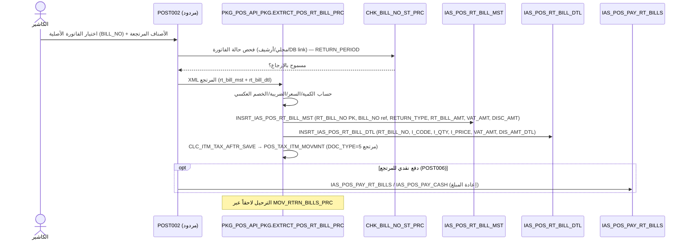

# FLOW_RETURN — المرتجعات / مردود المبيعات (End‑to‑End)

> **proof:** `docs/screens/POST002.md` (فاتورة مردود المبيعات) + `POST006.md` (الدفع النقدي للمرتجعات) + `POST022.md` (جرد أصناف مردود المبيعات) (+strings) · `PKG_POS_API_PKG.sql` (`EXTRCT_POS_RT_BILL_PRC`) · `PKG_POS_MOV_TRNS_PKG.sql` (`MOV_RTRN_BILLS_PRC`) · `db/schema/tables/IAS_POS_RT_BILL_MST.sql` + `IAS_POS_RT_BILL_DTL.sql`.

---

## 1. نظرة عامة — تمييز مهم

النظام يميّز:
- **الفاتورة اللحظية (RT)** `IAS_POS_RT_BILL_MST/DTL` — تُنشأ online قبل الترحيل، تُزامَن خارجياً فوراً.
- **مردود المبيعات (Return bill)** — شاشة POST002 تستخدم نفس بنية RT (`IAS_POS_RT_BILL_*`) كـ
  **فاتورة مرتجع** مرتبطة بالفاتورة الأصلية (`BILL_NO` في رأس RT). نقطة الدخول `EXTRCT_POS_RT_BILL_PRC`
  (نظير `EXTRCT_POS_BILL_PRC` لكن لـ RT) → `INSRT_IAS_POS_RT_BILL_MST/DTL`.

المرتجع يربط الفاتورة الأصلية، يفحص حالتها (`CHK_BILL_NO_ST_PRC` عبر محلي/أرشيف/DB link)، يحسب
الكميات المرتجعة + الضريبة/الخصم العكسي، ويُدرج في `IAS_POS_RT_BILL_MST/DTL`. الدفع النقدي للمرتجع
(الفكّة للعميل) في POST006 → `IAS_POS_PAY_RT_BILLS`/`IAS_POS_PAY_CASH`.

---

## 2. مخطّط Mermaid (sequence)

---

## 3. جدول الخطوات

| # | الخطوة | الواجهة (POST002/006) | المنطق (proc حقيقي) | الجدول → الأعمدة الحقيقية |
|---|--------|------------------------|----------------------|----------------------------|
| 1 | اختيار الفاتورة الأصلية | بحث `BILL_NO` | `CHK_BILL_NO_ST_PRC` (محلي/`IAS_POS_HST_BILL_MST`/DB link) | `IAS_POS_BILL_MST.BILL_NO`؛ `IAS_POS_HST_BILL_MST`؛ `IAS_POS_SERVER_DB_LINK.DB_LINK_NM` |
| 2 | فترة الإرجاع | — | `IAS_POS_MACHINE.RETURN_PERIOD` / `RETURN_CHANGE_TYPE` | `IAS_POS_MACHINE (RETURN_PERIOD, CHANGE_PERIOD)`؛ `IAS_PARA_POS (RETURN_PERIOD, RETURN_CHANGE_TYPE)` |
| 3 | الأصناف المرتجعة | blocks `IAS_POS_RT_BILL_DTL_TMP`/`_AUD_TMP` ثم `IAS_POS_RT_BILL_DTL` | `EXTRCT_POS_RT_BILL_PRC` | **`IAS_POS_RT_BILL_DTL`**: `RT_BILL_NO, RT_BILL_SRL, I_CODE, I_QTY, I_PRICE, I_PRICE_VAT, DIS_AMT_DTL, DIS_AMT_MST, VAT_AMT, FREE_QTY, RCRD_NO, RT_RPLC_AMT` |
| 4 | ترقيم المرتجع | — | `GET_RT_BILL_NO_PRC` (نظير GET_BILL_NO)؛ `SELECT POS_BILLS_SEQ.NEXTVAL FROM DUAL` | `IAS_POS_RT_BILL_MST.RT_BILL_NO, RT_BILL_SRL`؛ `IAS_POS_MACHINE.RT_SALE_SER` |
| 5 | إدراج الرأس | — | `INSRT_IAS_POS_RT_BILL_MST` | **`IAS_POS_RT_BILL_MST`** (PK `RT_BILL_NO`): `RT_BILL_SRL, RT_BILL_DATE, RT_BILL_TYPE, SR_TYPE, BILL_NO (الأصلية), C_CODE, A_CY, RT_BILL_RATE, RT_BILL_AMT, MACHINE_NO, MACHINE_NO_BILL, RETURN_TYPE, VAT_AMT, DISC_AMT, DISC_AMT_MST, DISC_AMT_DTL, PAYED_AMT, CUST_CODE, POINT_TYP_NO, W_CODE_BILL, REP_CODE_BILL` |
| 6 | حركة الضريبة | — | `CLC_ITM_TAX_AFTR_SAVE (DOC_TYPE=5)` + Trigger `TRG_IAS_POS_RTBILL_CHK_TYPTAX_TRG` | `POS_TAX_ITM_MOVMNT (DOC_TYPE=5, NET_TAX_AMT)` |
| 7 | دفع نقدي للمرتجع | POST006 | — | `IAS_POS_PAY_RT_BILLS`؛ `IAS_POS_PAY_CASH (RT_BILL_NO)` |
| 8 | نقاط عكسية | — | `POS_POINT_PKG` (حركة سالبة) | `Pos_Point_Calc_trns (TRNS_TYPE مرتجع)` |
| 9 | الترحيل | — | `MOV_RTRN_BILLS_PRC` → `MOV_RTRN_BILLS_TO_HSTRY_PRC` + `MOV_RTRN_TAX_TO_HSTRY_PRC` | `IAS_POS_HST_RT_BILL_MST/DTL`؛ خارجياً `POS_UPLINES_PKG.Refund_Invoice` |

---

## 4. ملاحظات لإعادة البناء
1. **المرتجع = مستند منفصل** (`RT_BILL_NO`) يربط الفاتورة الأصلية (`BILL_NO`) و`RETURN_TYPE` — لا تعدّل الفاتورة الأصلية، أنشئ مرتجعاً.
2. **فحص الحالة قبل الإرجاع** (`CHK_BILL_NO_ST_PRC`) عبر مصادر متعددة + **فترة الإرجاع** (`RETURN_PERIOD`).
3. **الضريبة بـ DOC_TYPE=5** (نظير 4 للبيع) في نفس جدول الحركة — احترم الإشارة العكسية.
4. **منع الإرجاع المكرّر/الزائد** على الكمية المباعة (تحقّق من المرتجعات السابقة لنفس `BILL_NO`).
5. **استبدال (RT_RPLC_AMT):** المرتجع قد يكون نقداً أو استبدال صنف — صمّم النوعين.
6. الـ backend الحالي يعرّف `bills/refund` في API_DESIGN لكن لم يُنفّذ بعد (مرحلة الكتابة).

## 5. ثغرات
- `IAS_POS_RT_BILL_MST` (221 صف) / `DTL` (368) فيها بيانات → golden ممكن جزئياً، لكن **الضريبة/الخصم = صفر** كبقية الداتاسيت.
- جداول مؤقتة كثيرة (`IAS_POS_RT_BILL_DTL_TMP/_AUD_TMP`, `IAS_POS_BILL_DTL_TMP`) تُستخدم في تدفّق POST002 — منطقها التحضيري يحتاج تتبّع أعمق.
- `POS_UPLINES_PKG.Refund_Invoice` (مرتجع خارجي للمنصّات) يحتاج تفاصيل المصادقة (Login/Api_Key).
