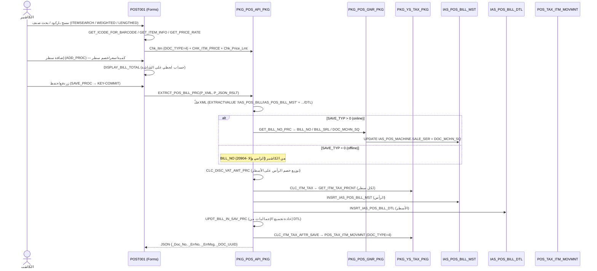

# FLOW_SALE_BILL — فاتورة البيع الكاملة (الأهم — End‑to‑End)

> **proof:** `docs/screens/POST001.md` (+`_raw/POST001_strings.txt`) · `db/schema/plsql/PKG_POS_API_PKG.sql`,
> `PKG_POS_GNR_PKG.sql`, `PKG_YS_TAX_PKG.sql` · `db/schema/tables/IAS_POS_BILL_MST.sql` + `IAS_POS_BILL_DTL.sql`
> + `POS_TAX_ITM_MOVMNT.sql` · `docs/db/SALES_FLOW.md` §1–8.
> **الشاشة:** `POST001` — «فاتورة المبيعات» (4.79MB، 59 blocks، 53 canvases، 152 PU، 180 جدول). غاية النظام.

---

## 1. نظرة عامة (نقطة الدخول: XML CLOB)

شاشة POST001 تبني **فاتورة كـ XML** (رأس `IAS_POS_BILL_MST` + أسطر `IAS_POS_BILL_DTL` + قسم دفع)
وتُرسلها إلى **نقطة الدخول الوحيدة** `PKG_POS_API_PKG.EXTRCT_POS_BILL_PRC(P_XML CLOB, P_JSON_RSLT OUT CLOB)`.
الإجراء يفكّ XML بـ `XMLTYPE.CREATEXML`/`EXTRACTVALUE`، يحسب الخصم والضريبة، يولّد الرقم (online)،
يُدرج MST ثم DTL، يعيد تجميع الإجماليات، يبني حركة الضريبة، ثم يرجّع JSON بـ `_Doc_No/_ErrNo/_ErrMsg/_DOC_UUID`.

**وضع الحفظ `SAVE_TYP`** (تعليق الكود حرفياً):
```
0 = OFFLINE (BILL_NO مُولَّد بالكاشير محلياً — إلزامي وإلا RAISE -20904 'BILL_NO IS NULL')
1 = ONLINE SAVE IN DB
2 = ONLINE CLC AND RETURN BILL DATA XML — NO SAVE  (حساب فقط)
3 = ONLINE SAVE BILL AFTER CLC AND RETURN BILL DATA
```
**فاتورة معلّقة (HUNG=1):** قبل إعادة البناء يُحذف من `IAS_POS_BILL_MST`, `IAS_POS_BILL_DTL`,
`POS_TAX_ITM_MOVMNT (DOC_TYPE=4)`, `IAS_POS_PAY_BILLS` ثم يُعاد الإدراج.

---

## 2. مخطّط Mermaid (sequence)



---

## 3. جدول الخطوات (الإدخال → المعالجة → جدول النتيجة → الأعمدة)

| # | الخطوة | الواجهة (POST001) | المنطق (proc حقيقي) | الجدول → الأعمدة الحقيقية |
|---|--------|-------------------|----------------------|----------------------------|
| 0 | شرط الوردية | header وردية | `GET_WRK_SHFT_OPN_FNC(CSHR_NO)` | `POS_WRK_SHFT_CSHR (SHFT_SRL, CLS_DATE IS NULL)` |
| 1 | بحث صنف/باركود | blocks `ITEMSEARCH` (ORDER:I_Name), `WEIGHTED` (Length(I_Code)=:1), `LENGTHED`, `ITM_GRP` | `GET_ICODE_FOR_BARCODE`, `GET_BARCODE_SIZE`, `GET_ITEM_INFO`, `FETCH_ITMS_SRCH_PKG` | `IAS_ITM_MST (I_CODE,I_NAME)`, `IAS_ITEM_PRICE`, `IAS_V_ITM_AVL_QTY` *(synonym→IAS202623)*؛ المتاح محلياً: `MV_ITEM_AVL_QTY`, `IAS_POS_BILL_DTL (آخر سعر/باركود)` |
| 2 | فحص الصنف/السعر | تنبيهات `AL_LOW_PR/AL_HIGH_PR/AL_P_LIMIT` | `Chk_Itm (DOC_TYPE=4 بيع / 5 مرتجع)`, `CHK_ITM_PRICE`, `Chk_Price_Lmt`, `CHECK_I_PRICE` | `IAS_ITEM_PRICE`, `IAS_PRICING_LEVELS` |
| 3 | الكمية المتاحة | (اختياري حسب «فحص الكمية المتوفرة») | `FUNC_GET_ICODE_AVLQTY` / `MV_ITEM_AVL_QTY` | `MV_ITEM_AVL_QTY (I_CODE, W_CODE, AVL_QTY)` |
| 4 | إضافة سطر | block `IAS_POS_BILL_DTL` (ORDER:RCRD_NO) | `ADD_PROC` (يبني سطر XML) | `IAS_POS_BILL_DTL`: `I_CODE, I_QTY, I_PRICE, FREE_QTY, ITM_UNT, P_SIZE, BARCODE, W_CODE, RCRD_NO` |
| 5 | خصم السطر/البطاقة | `GET_DISCOUNT`, `GET_DISC_ITEM`, `CHECK_DISC_PRIV` | — | `IAS_POS_BILL_DTL`: `DIS_PER, DIS_AMT, DIS_AMT_DTL` |
| 6 | توليد الرقم (online) | — | `PKG_POS_GNR_PKG.GET_BILL_NO_PRC` (انظر §4) | `IAS_POS_BILL_MST (BILL_NO, BILL_SRL, DOC_MCHN_SQ)`; `IAS_POS_MACHINE.SALE_SER` (UPDATE); `IAS_PARA_POS (POS_BILL_SERIAL, USER_DIGIT, MACHINE_DIGIT, SERIAL_DIGIT)` |
| 7 | توزيع خصم الرأس | `MAIN_CALC_BLK` | `CLC_DISC_VAT_AMT_PRC` (§5) | `IAS_POS_BILL_DTL (DIS_AMT_DTL, DIS_AMT_MST)`; `IAS_POS_BILL_MST (DISC_AMT_MST, DISC_AMT_DTL)` |
| 8 | ضريبة كل سطر | — | `CLC_ITM_TAX` ← `YS_TAX_PKG.GET_ITM_TAX_PRCNT(CLC_TYP_NO_TAX, I_CODE)` (§6) | `IAS_POS_BILL_DTL`: `VAT_PER, VAT_AMT, I_PRICE_VAT, VAT_AMT_BFR_DIS, VAT_AMT_AFTR_DIS, DIS_AMT_DTL_VAT, DIS_AMT_MST_VAT, DIS_AFTR_VAT_MST` |
| 9 | إدراج الرأس | — | `INSRT_IAS_POS_BILL_MST` | **`IAS_POS_BILL_MST`** (PK `BILL_NO`): `BILL_SRL, DOC_MCHN_SQ, BILL_DATE, BILL_TIME, BILL_TYPE, SI_TYPE, C_CODE, A_CY, BILL_RATE, BILL_AMT, MACHINE_NO, CASH_NO, W_CODE, HUNG, POSTED, PAYED_AMT, CARD_AMT, VAT_AMT, DISC_AMT, DISC_AMT_MST, DISC_AMT_DTL, CLC_TYP_NO_TAX, CUST_CODE, POINT_TYP_NO, POINT_RPLC_AMT, MOBILE_NO, CREDIT_CARD` |
| 10 | إدراج الأسطر | — | `INSRT_IAS_POS_BILL_DTL` | **`IAS_POS_BILL_DTL`** (FK `BILL_NO`, idx `POSBILLDTL_UQ`): `BILL_SRL, I_CODE, I_QTY, FREE_QTY, I_PRICE, I_PRICE_VAT, DIS_AMT_DTL, DIS_AMT_MST, VAT_AMT, VAT_PER, ITM_UNT, P_SIZE, BARCODE, W_CODE, RCRD_NO, QT_PRM_SER, DOC_D_SEQ` |
| 11 | إعادة التجميع | — | `PST_INSRT_BILL_PRC` → `UPDT_BILL_IN_SAV_PRC` (+`GNR_QTN_PRM_PKG.CLC_DOC_QTN_PRM` للعروض) (§7) | `IAS_POS_BILL_MST (BILL_AMT, VAT_AMT, DISC_AMT)` تُعاد كتابتها |
| 12 | حركة الضريبة | — | `YS_TAX_PKG.CLC_ITM_TAX_AFTR_SAVE` (يحذف ثم يدرج) (§8) | **`POS_TAX_ITM_MOVMNT`** (DOC_TYPE=4): `DOC_SER, I_CODE, I_PRICE, I_QTY, FREE_QTY, TAX_PRCNT, ITM_NET_PRICE, ITM_NET_QTY, ITM_NET_AMT, NET_TAX_AMT, ITM_VAT_CAT_CODE, ITM_VAT_EX_RSN_CODE, TAX_CUR_CODE, TAX_CUR_RATE, BILL_TAX_STATUS, CLC_TAX_FREE_QTY_FLG` |
| 13 | فرض نوع الضريبة | — | **Trigger** `TRG_IAS_POS_BILL_CHK_TYP_TAX_TRG` | `IAS_POS_BILL_MST.CLC_TYP_NO_TAX` |

---

## 4. توليد الرقم — `GET_BILL_NO_PRC` (proof حرفي من PKG_POS_GNR_PKG)

```sql
-- إن POS_BILL_SERIAL=1 (يتضمن رقم المستخدم):
BILL_NO  = Substr(YR,3,2) || SRVR_NO || Lpad(MACHINE_NO,MACHINE_DIGIT,0) || AD_USR_NO || Lpad(Nvl(SALE_SER,0)+1, SERIAL_DIGIT, 0)
-- وإلا (بدون رقم المستخدم):
BILL_NO  = Substr(YR,3,2) || SRVR_NO || Lpad(MACHINE_NO,MACHINE_DIGIT,0) || Lpad(Nvl(SALE_SER,0)+1, SERIAL_DIGIT, 0)
DOC_MCHN_SQ = Nvl(SALE_SER,0)+1
BILL_SRL = Substr(YR,3,2) || '01' || Lpad(SRVR_NO,3,0) || Lpad(MACHINE_NO,5,0) || Nvl(DOC_MCHN_SQ,0)
-- ثم:
UPDATE IAS_POS_MACHINE SET SALE_SER = DOC_MCHN_SQ WHERE MACHINE_NO = P_MCHN_NO;   -- (إن P_UPD_MCHN_FLG=1)
```
أخطاء: `-20020` (فشل قراءة آخر رقم)، `-20022` (فشل تحديث `SALE_SER`). الأرقام (`USER_DIGIT/MACHINE_DIGIT/SERIAL_DIGIT/POS_BILL_SERIAL`) من `IAS_PARA_POS`.

## 5. الخصم — `CLC_DISC_VAT_AMT_PRC` (proof)
```
P_DIS_AMT_MST = (DISC_AMT_MST / (TOT_ITEM_PRICE - TOT_DISC)) * (I_PRICE - DIS_AMT_DTL)   -- توزيع تناسبي
P_DIS_AMT     = DIS_AMT_MST + DIS_AMT_DTL
```
يدعم: بطاقة خصم (`DISC_CARD_PRCNT`)، عروض (`TOTAL_PRICE_WITH_PRM`)، خصم قبل/بعد الضريبة، علم `CLC_SI_DISC_WITHOUT_ITM_DISC`.

## 6. الضريبة — `CLC_ITM_TAX` (proof) — النسبة من `GET_ITM_TAX_PRCNT(CLC_TYP_NO_TAX, I_CODE)`
- **نوع 1** (على السعر الكامل): `VAT_AMT = ROUND(I_PRICE * VAT_PRCNT/100, 12)`
- **نوع 2** (بعد الخصم): `VAT_AMT = ROUND((I_PRICE-(DIS_AMT_DTL+DIS_AMT_MST)) * VAT_PRCNT/100, 12)`
- سعر شامل الضريبة (`USE_PRICE_INCLUDE_VAT=1`): `DIS_AMT_DTL = ROUND(DIS_AMT_DTL_VAT / (VAT_PRCNT/100 + 1), 12)`
- نوع الحساب يُحدَّد بـ `IAS_POS_MACHINE.CLC_TYP_NO_TAX` (لكل جهاز).

## 7. إعادة التجميع — `UPDT_BILL_IN_SAV_PRC` (proof) — يُعاد جمع الرأس من DTL:
```
BILL_AMT  ← SUM(I_QTY*I_PRICE)
VAT_AMT   ← SUM((I_QTY + FREE_QTY*CLC_TAX_FREE_QTY_FLG) * VAT_AMT)
DISC_AMT  ← SUM(I_QTY*DIS_AMT_DTL) (+ خصم الرأس)
(I_PRICE_VAT ← SUM(I_QTY*I_PRICE_VAT))
```
**حرج:** الإجماليات لا تُؤخذ من رأس الكاشير — تُعاد حسابها دوماً بعد الإدراج.

## 8. حركة الضريبة — `CLC_ITM_TAX_AFTR_SAVE` (proof)
```
ITM_NET_PRICE = I_PRICE - (DIS_AMT_MST+DIS_AMT_DTL)*(I_QTY/(I_QTY+FREE_QTY))
ITM_NET_AMT   = ITM_NET_PRICE * ITM_NET_QTY
NET_TAX_AMT   = ITM_NET_AMT * TAX_PRCNT / 100
```
يحذف الحركة القديمة لنفس `DOC_TYPE/DOC_SER` ثم يدرج، ويملأ حقول الفوترة الإلكترونية (`ITM_VAT_CAT_CODE, ITM_VAT_EX_RSN_CODE, TAX_CUR_CODE, TAX_CUR_RATE, BILL_TAX_STATUS`).

---

## 9. ملاحظات لإعادة البناء (Motech POS الجديد)

1. **نقطة دخول واحدة محصّنة:** كرّر فكرة `EXTRCT_POS_BILL_PRC` كـ **`PostBillUseCase`** خلف `Idempotency-Key`
   (uuid v7) — يحسب ثم يحفظ ذرّياً ويُرجع رقم الفاتورة. الـ domain يفرض الثوابت (وردية مفتوحة، إعادة التجميع، نوعا الضريبة/الخصم).
2. **الإجماليات تُعاد حسابها دوماً** (`net = Σ qty·price − disc + vat`) — لا تثق برأس العميل. منفّذ في `Bill` aggregate + golden test (طابق 500 فاتورة بدقّة 100%).
3. **نوعا الضريبة** (1 على السعر / 2 بعد الخصم) + **توزيع خصم الرأس تناسبياً** → منفّذان كـ `BillLine`/`DiscountPolicy` (unit-tested من §5/§6).
4. **`SAVE_TYP`:** offline (الكاشير يولّد الرقم) ↔ online (الخادم يولّد). PWA الجديد offline-first: ولّد UUID محلي + طابور IndexedDB، ثم زامِن (scaffold جاهز في `shared/offline/db.ts`).
5. **HUNG (تعليق):** فاتورة معلّقة تُحذف وتُعاد بناءً عند الاستئناف — كرّرها كحالة «hold/resume» idempotent.
6. **`POS_TAX_ITM_MOVMNT`** ليست اشتقاقاً — بل جدول حركة منفصل يُبنى بعد الحفظ (للفوترة الإلكترونية والتقارير الضريبية). يجب توليده ضمن نفس المعاملة.
7. **الترقيم:** صيغة `BILL_NO`/`BILL_SRL` المركّبة (سنة+سيرفر+جهاز+[مستخدم]+تسلسل) — احفظها للتوافق مع الترحيل للمركز، أو ولّد سيرفر-سايد مكافئ.

## 10. ثغرات تحتاج IAS202623 (الجاري سحبه) أو screenshots
- **أسماء الأصناف وأسعارها:** `IAS_ITM_MST/IAS_ITEM_PRICE/IAS_V_ITM_AVL_QTY` كلها **synonyms → IAS202623 غائب** (views INVALID، ORA-04063). حالياً الاسم=null والسعر يُعاد بناؤه من `MV_ITEM_AVL_QTY`+`IAS_POS_BILL_DTL` (موثّق في `CATALOG_DATA_NOTE.md`). **يُحلّ كاملاً عند توفّر IAS202623.**
- **الداتاسيت الحالي ضريبته وخصومه = صفر** على كل الفواتير → golden يُثبت مسار بلا‑ضريبة فقط؛ منطق الضريبة/الخصم مُثبَت بـ unit tests. عند تحميل بيانات بضرائب سيتحقّق golden تلقائياً.
- **العروض/الكوبونات/وصفتي (Wasfaty)/العمولات/البطاقات** (blocks `POS_BILL_CPN`, `WSFTY_*`, `IAS_QUT_PRM_*`, `IAS_POS_CUSTOMER_CARD_AMOUNT`): مسارات فرعية في POST001 — تفاصيل التسعير في `GNR_QTN_PRM_PKG`/`CPN_PKG` (غير مُحلّلة بعمق) قد تحتاج screenshots للتدفّق البصري.
- **تخطيط الشاشة (53 canvas) وتسميات الحقول العربية** = screenshots.
