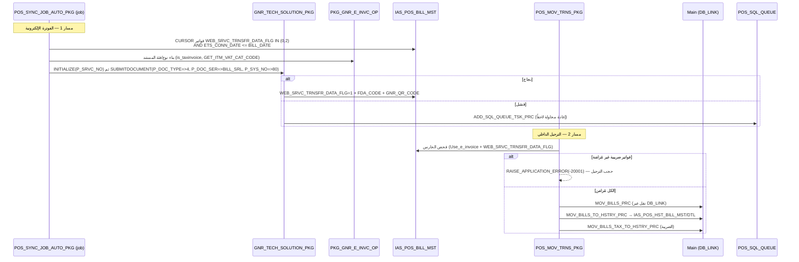

# FLOW_SYNC — المزامنة مع المركز + الفوترة الإلكترونية (End‑to‑End)

> **proof:** `db/schema/plsql/PKG_POS_MOV_TRNS_PKG.sql` (`-20001` حرفياً سطر 112/591) · `PKG_POS_SYNC_JOB_AUTO_PKG.sql` (`SUBMITDOCUMENT` سطر 65، `WEB_SRVC_TRNSFR_DATA_FLG IN (0,2)` سطر 26، `ETS_CONN_DATE` سطر 30) · `PKG_GNR_E_INVC_OP.sql` · `PKG_GNR_TECH_SOLUTION_PKG.sql` · `PKG_POS_GNR_PKG.sql` (`ADD_SQL_QUEUE_TSK_PRC`) · `PKG_POS_UPLINES_PKG.sql` · `docs/screens/POST008.md` (مزامنة البيانات) · `db/schema/tables/POS_SQL_QUEUE.sql`.

---

## 1. نظرة عامة — مساران متوازيان

النظام موزّع: **POS فرعي ↔ Main server** عبر database links (`IAS_POS_SERVER_DB_LINK`، 5 روابط).
المزامنة على مسارين:
1. **الترحيل الداخلي (DB-link):** `POS_MOV_TRNS_PKG.MOV_BILLS_PRC` ينقل الفواتير المُحفوظة (`POSTED=0, HUNG=0`) من POS الفرعي إلى Main + الأرشفة.
2. **الفوترة الإلكترونية (Web Service):** `POS_SYNC_JOB_AUTO_PKG.POS_SYNC_DOC_TCH_SLTION_PRC` (job) يرفع المستند الضريبي لمنصّة الهيئة عبر `GNR_TECH_SOLUTION_PKG.SUBMITDOCUMENT`.

**الحارس الحرج:** `MOV_BILLS_PRC` يرفض الترحيل إن وُجدت فواتير ضريبية لم تُزامَن:
```sql
RAISE_APPLICATION_ERROR(-20001,'There are tax bills not Sync. to tax authority bills count='||V_Cnt);
```
(عند `Use_e_invoice=1` و فواتير `WEB_SRVC_TRNSFR_DATA_FLG<>1` و`FDA_CODE IS NULL`).

**طابور إعادة المحاولة:** `POS_GNR_PKG.ADD_SQL_QUEUE_TSK_PRC` → `POS_SQL_QUEUE` (job `POS23_SQL_QUEUE_JOB`).

---

## 2. مخطّط Mermaid (sequence)



---

## 3. جدول الخطوات

| # | الخطوة | المنطق (proc حقيقي + proof) | الجدول → الأعمدة الحقيقية |
|---|--------|------------------------------|----------------------------|
| 1 | اختيار فواتير الفوترة الإلكترونية | `CURSOR PST_BILL: SELECT BILL_SRL,BRN_NO,WEB_SRVC_TRNSFR_DATA_FLG FROM IAS_POS_BILL_MST WHERE NVL(WEB_SRVC_TRNSFR_DATA_FLG,0) IN (0,2) AND ETS_CONN_DATE IS NOT NULL AND ETS_CONN_DATE <= M.BILL_DATE` | `IAS_POS_BILL_MST (BILL_SRL, BRN_NO, WEB_SRVC_TRNSFR_DATA_FLG, FDA_CODE)`؛ `S_CMPNY.ETS_CONN_DATE` |
| 2 | بناء المستند الضريبي | `PKG_GNR_E_INVC_OP` (`is_export, is_simplified, is_taxinvoice, GET_ITM_VAT_CAT_CODE, CHK_TAX_CAT_RSN`) | يقرأ `POS_TAX_ITM_MOVMNT (ITM_VAT_CAT_CODE, NET_TAX_AMT, ...)` |
| 3 | الرفع | `GNR_TECH_SOLUTION_PKG.INITIALIZE(P_SRVC_NO)` ثم `SUBMITDOCUMENT(P_DOC_TYPE=>4, P_DOC_SER=>BILL_SRL, P_BRN_NO, P_SYS_NO=>80)` | — |
| 4 | تحديث حالة المزامنة | عند `WEB_SRVC_TRNSFR_DATA_FLG=0` → رفع، ثم تعليم =1 + FDA_CODE | `IAS_POS_BILL_MST.WEB_SRVC_TRNSFR_DATA_FLG, FDA_CODE`؛ `GNR_QR_CODE` |
| 5 | رمز QR | `PKG_GNR_QR_CODE_API_PKG` | `GNR_QR_CODE`؛ `IAS_POS_BILL_DTL.QR_CODE` |
| 6 | طابور إعادة المحاولة | `POS_GNR_PKG.ADD_SQL_QUEUE_TSK_PRC` → `EXEC_SQL_QUEUE_TSK_PRC` (job `POS23_SQL_QUEUE_JOB`) | **`POS_SQL_QUEUE`**: `DOC_SRL, SQL_STMNT, EXEC_TIME, FAILURE_DLT_FLG, ALLWD_RTRY_CNT, RTRY_CNT, AD_DATE` |
| 7 | **الحارس** | `MOV_BILLS_PRC`: إن فواتير ضريبية غير مُزامَنة → `RAISE_APPLICATION_ERROR(-20001,'There are tax bills not Sync...')` | `IAS_POS_BILL_MST (WEB_SRVC_TRNSFR_DATA_FLG<>1, FDA_CODE IS NULL)` |
| 8 | الترحيل الداخلي | `MOV_BILLS_PRC(P_POS_SCMA, P_DB_LNK)` (فواتير `POSTED=0, HUNG=0`) عبر `CHK_MAIN_SRVR_CNCT_FNC` أولاً | `IAS_POS_BILL_MST (POSTED, MOV_DATE)` عبر DB_LINK |
| 9 | الأرشفة | `MOV_BILLS_TO_HSTRY_PRC` + `MOV_BILLS_TAX_TO_HSTRY_PRC` | `IAS_POS_HST_BILL_MST/DTL`؛ `POS_TAX_ITM_MOVMNT_HSTRY` |
| 10 | مزامنة بقية الكيانات | `MOV_RTRN_BILLS_PRC`, `MOV_RT_PYMNT_CSH_PRC`, `MOV_WRK_SHFT_PRC`, `MOV_CASHIER_DEPOSIT_PRC`, `MOV_BILLS_DIFF_PRC`, `MOV_CASH_CUSTMR_PRC`, `MOV_POS_AUD_ITM_PRC` | الجداول المقابلة + `_HSTRY` |
| 11 | RT/خارجي فوري | `POS_UPLINES_PKG.Register_Invoice`/`SYNC_RT_BILL_PRC(P_RT_BILL_SRL,P_TYP)` | `POS_EXTRNL_DOC_SYNC.DOC_SER_EXTRNL`؛ `IAS_EXTRNL_SYS_SYNC_LOG` |
| 12 | إدارة المزامنة | جدول قائمة الجداول المُزامَنة | `POS_SYNC_MNGMNT (TBL_NM)` (252 صف)؛ `IAS_POS_SERVER_DB_LINK (DB_LINK_NM, SERVER_NO)` (5) |

---

## 4. ملاحظات لإعادة البناء
1. **الحارس -20001 ثابت معماري:** لا ترحيل/إقفال نهائي قبل مزامنة كل الفواتير الضريبية. افرضه في الـ domain (حالة `pending-tax-sync` تمنع الترحيل).
2. **مساران منفصلان:** (أ) e-invoice (web service، فوري/job) (ب) ترحيل داخلي (دفعة). لا تخلطهما.
3. **طابور موثوق:** كرّر `POS_SQL_QUEUE` كـ **BullMQ** (مذكور في الـ stack) مع `RTRY_CNT/ALLWD_RTRY_CNT` + backoff؛ احذف عند النجاح.
4. **حالة الفاتورة:** `WEB_SRVC_TRNSFR_DATA_FLG` (0 جديد / 1 مُزامَن / 2 إعادة) + `FDA_CODE` (معرّف الهيئة) + `POSTED` (مُرحَّل). انمذجها كـ state machine.
5. **فحص اتصال المركز** (`CHK_MAIN_SRVR_CNCT_FNC`) قبل أي دفعة ترحيل.
6. **offline-first:** الكاشير يبيع offline؛ المزامنة لاحقة — يطابق نهج PWA + طابور IndexedDB (scaffold جاهز).
7. الـ API يعرّف `sync push/pull` في `docs/API_DESIGN.md` (لم يُنفّذ بعد).

## 5. ثغرات
- `POS_SQL_QUEUE`, `POS_EXTRNL_DOC_SYNC`, `IAS_POS_HST_*` **فارغة** → لا golden للمزامنة.
- `SUBMITDOCUMENT` ومنطق `PKG_GNR_TECH_SOLUTION_PKG`/`PKG_GNR_SND_DATA_TO_API_PKG`/`PKG_GNR_TFF_GATEWAY_PKG` يعتمد على web service خارجي (هيئة الضرائب) — البنية مُستخرجة لكن بروتوكول الـ API الخارجي + المصادقة (`Login/Generate_Api_Key/Refresh_Access_Token` في UPLINES) يحتاج توثيق المنصّة.
- `S_CMPNY.ETS_CONN_DATE`, `FDA_CODE`, بنية روابط DB في المخطط المركزي/البيئة.
